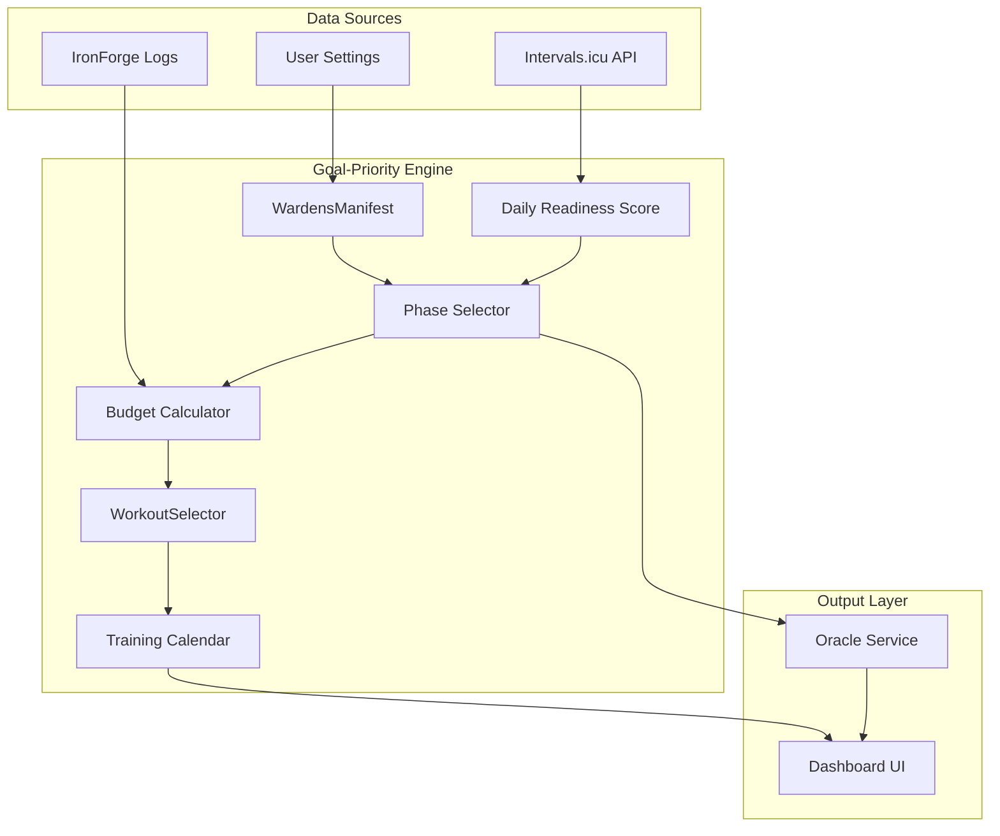

# Goal-Priority Engine Specification

**Priority:** Critical | **Effort:** M | **ROI:** 5.2 | **Status:** Design
**Integrated with:** Oracle 3.0 (This engine provides the deterministic core for the AI Coach)

> **Analysts:** `/titan-coach` + `/game-designer` + `/analyst`
> **Philosophy:** "Oracle is the Voice, GPE is the Brain. Together they create the Synthetic Coach."

---

## 1. Executive Summary

The **Goal-Priority Engine (GPE)** is the deterministic training orchestration system that powers **The Oracle**. It allows the Oracle to provide guidance that is both narratively rich and scientifically absolute.

### The Symbiosis: Voice + Brain

| Aspect | The Oracle (Voice/NLU) | Goal-Priority Engine (Brain/Logic) |
|--------|------------------------|------------------------------------|
| **Role** | Narrative delivery, FAQ, Motivation | Periodization, Volume calc, Interference |
| **Logic** | LLM (Gemini 2.0 Flash/Pro) | Path-Agnostic Deterministic Algorithm |
| **Output** | "Your iron heart grows weary..." | `phase: DELOAD, cardioTss: 150` |
| **Value** | User engagement & Persona | Physical safety & Adaptation |

**The Result**: A coach that knows the math but speaks like a titan.

### Why Not AI?

| Aspect | AI (Oracle 3.0) | Algorithm (GPE) |
|--------|-----------------|-----------------|
| **Latency** | 1-3 seconds | < 50ms |
| **Cost** | $0.001-0.01/query | $0 |
| **Explainability** | "Trust me" | Full formula transparency |
| **Consistency** | Variable | Deterministic |
| **Offline** | ❌ | ✅ |
| **Testability** | Difficult | Unit test everything |

**AI keeps value for**: Conversational FAQ, plateau psychology, narrative flavor.
**AI removed from**: Core training logic, daily recommendations, phase transitions.

---

## 1.5 Path-Agnostic Design

The Goal-Priority Engine works for **all Training Paths**, not just Warden:

| Path | Example Goals | Phase Rotation |
|------|---------------|----------------|
| **Juggernaut** | Max Squat, Max Bench, Max Deadlift, Hypertrophy | SBD rotation by lift focus |
| **Pathfinder** | VO2max, FTP Bike, FTP Run, Ultra Distance | Cardio modality rotation |
| **Warden** | VO2max, FTP, Strength, Fitness | Cardio ↔ Strength rotation |

```typescript
// Path-specific goal pools
const GOAL_POOLS: Record<TrainingPath, TrainingGoal[]> = {
  JUGGERNAUT: ["SQUAT_1RM", "BENCH_1RM", "DEADLIFT_1RM", "WILKS", "HYPERTROPHY", "POWER"],
  PATHFINDER: ["VO2MAX", "FTP_BIKE", "FTP_RUN", "ENDURANCE", "SPRINT_POWER"],
  WARDEN: ["VO2MAX", "FTP_BIKE", "FTP_RUN", "STRENGTH", "HYPERTROPHY", "FITNESS", "BODY_COMP"],
};
```

The engine logic is the same – only the available goals and phase allocation differ per path.

### Goal Interference Matrix

| Goal A | Goal B | Interference | Resolution |
|--------|--------|--------------|------------|
| VO2max | Strength | 🔴 High | Block periodization |
| FTP (bike) | FTP (run) | 🟡 Medium | Skill transfer exists |
| Endurance | Hypertrophy | 🔴 High | Cannot peak simultaneously |
| Strength | Power | 🟢 Low | Sequential progression |
| Mobility | All | ✅ None | Always beneficial |

### Key Insight

> **You cannot maximize everything simultaneously. The engine's job is to rotate priorities intelligently while maintaining minimum effective volume (MEV) for non-focus goals.**

---

## 2. System Architecture

### 2.1 Component Overview



### 2.2 State Persistence Layers

| State | Storage | TTL | Migration |
|-------|---------|-----|-----------|
| `WardensManifest` | Supabase `user_goals` | Permanent | Schema version field |
| `PlannedSession[]` | Supabase `planned_sessions` | 4 weeks | Auto-archive |
| `TrainingStreak` | Supabase `user_stats` | Permanent | — |
| `DailyReadiness` | LocalStorage cache | 24h | Refresh on load |
| `CalendarDay[]` | Supabase `calendar_days` | 1 year | Auto-prune |

### 2.3 Data Flow

```
┌────────────────────────────────────────────────────────────────┐
│                        INPUTS                                  │
├──────────────────┬──────────────────┬─────────────────────────┤
│  Intervals.icu   │   IronForge DB   │     User Settings       │
│  (HRV, TSS, etc) │  (Sets, e1RM)    │  (Goals, Prefs)         │
└────────┬─────────┴────────┬─────────┴───────────┬─────────────┘
         │                  │                     │
         ▼                  ▼                     ▼
┌────────────────────────────────────────────────────────────────┐
│                    GOAL-PRIORITY ENGINE                        │
├────────────────────────────────────────────────────────────────┤
│  1. selectPhase()     → Macro planning                        │
│  2. calculateBudget() → Resource allocation                   │
│  3. selectWorkout()   → Exercise selection                    │
│  4. generateWeekPlan()→ Calendar population                   │
└────────────────────────────────────────────────┬───────────────┘
                                                 │
                                                 ▼
┌────────────────────────────────────────────────────────────────┐
│                        OUTPUTS                                 │
├────────────────────┬───────────────────────────────────────────┤
│   Oracle Decree    │          Dashboard UI                     │
│  ("Squat today")   │  (Calendar, Progress, Heatmap)           │
└────────────────────┴───────────────────────────────────────────┘
```

### 2.4 Onboarding Wizard (First-Time Setup)

When `WardensManifest` is null, the user is guided through a 4-step wizard:

```typescript
interface OnboardingStep {
  id: number;
  title: string;
  component: React.FC;
}

const ONBOARDING_STEPS: OnboardingStep[] = [
  { id: 1, title: "Choose Your Path", component: PathSelector },
  { id: 2, title: "Set Your Goals", component: GoalPrioritizer },
  { id: 3, title: "Connect Data", component: IntervalsConnect },
  { id: 4, title: "Weekly Availability", component: AvailabilityPicker },
];
```

**Step 1: Path Selection**

```
┌────────────────────────────────────────────────┐
│  ⚔️ CHOOSE YOUR PATH                           │
├────────────────────────────────────────────────┤
│                                                │
│  [ 🛡️ WARDEN ]     Hybrid Athlete             │
│  [ 💪 JUGGERNAUT ] Pure Strength              │
│  [ 🏃 PATHFINDER ] Endurance Focus            │
│                                                │
│  Each path unlocks specific goals and         │
│  training templates.                          │
│                                                │
└────────────────────────────────────────────────┘
```

**Step 2: Goal Prioritization**

```
┌────────────────────────────────────────────────┐
│  🎯 PRIORITIZE YOUR GOALS                      │
├────────────────────────────────────────────────┤
│                                                │
│  Drag to reorder (top = highest priority):    │
│                                                │
│  ① VO2max      [Target: 55 ml/kg/min]        │
│  ② Strength    [Target: 400 Wilks]           │
│  ③ FTP (Bike)  [Target: 300 W]               │
│                                                │
│  ⚠️ Conflicting goals will be rotated        │
│                                                │
└────────────────────────────────────────────────┘
```

**Step 3: Data Connection**

```
┌────────────────────────────────────────────────┐
│  🔗 CONNECT YOUR DATA                          │
├────────────────────────────────────────────────┤
│                                                │
│  [ ✅ Intervals.icu Connected ]               │
│  [ 🔄 Garmin Sync Active ]                    │
│                                                │
│  Optional:                                     │
│  [ ] Enable menstrual cycle tracking          │
│  [ ] Enable blood glucose monitoring          │
│                                                │
│  ⚠️ Health data requires explicit consent    │
│                                                │
└────────────────────────────────────────────────┘
```

**Step 4: Weekly Availability**

```
┌────────────────────────────────────────────────┐
│  📅 WEEKLY AVAILABILITY                        │
├────────────────────────────────────────────────┤
│                                                │
│  Tap days you can train:                       │
│                                                │
│  [Mon] [Tue] [Wed] [Thu] [Fri] [Sat] [Sun]   │
│   ✅    ✅    ❌    ✅    ❌    ✅    ❌      │
│                                                │
│  Detected: 4 training days/week               │
│  Recommended split: Upper/Lower/Rest/Push/... │
│                                                │
└────────────────────────────────────────────────┘
```

### 2.5 Edge Case Handling

| Scenario | Behavior |
|----------|----------|
| `goals.length === 0` | Force redirect to onboarding Step 2 |
| `manifest === null` | Show onboarding wizard |
| All calendar days blocked | Show warning, suggest minimum 2 days |
| No Intervals.icu connection | Use manual entry mode, reduced features |
| Streak broken during travel | Auto-apply "Travel Freeze" if marked blocked |

---

## 3. Core Data Model

### Goal Declaration

```typescript
// src/types/goals.ts
export type TrainingGoal =
  | "VO2MAX"        // Max aerobic capacity
  | "FTP_BIKE"      // Functional Threshold Power (cycling)
  | "FTP_RUN"       // vVO2max / running economy
  | "STRENGTH"      // 1RM on compound lifts (Wilks)
  | "HYPERTROPHY"   // Muscle mass (volume-driven)
  | "ENDURANCE"     // Long-distance capability
  | "FITNESS"       // Intervals.icu Fitness metric
  | "BODY_COMP";    // Weight management focus

export interface GoalPriority {
  goal: TrainingGoal;
  weight: number;           // 0.0 - 1.0, sum must equal 1.0
  currentValue?: number;    // Latest measurement
  targetValue?: number;     // User's target
  deadline?: Date;          // Optional peak date
}

export interface WardensManifest {
  userId: string;
  goals: GoalPriority[];    // Ordered by priority
  phase: MacroPhase;
  phaseStartDate: Date;
  phaseWeek: number;
  autoRotate: boolean;      // Let engine decide phase transitions
  
  // Privacy & Consent
  consents: {
    healthData: boolean;    // Allow processing menstrual/blood-glucose data
    leaderboard: boolean;   // Allow public sharing of PRs
  };
}

export type MacroPhase =
  | "CARDIO_BUILD"    // VO2max/FTP focus (MEV strength)
  | "STRENGTH_BUILD"  // Strength/Hypertrophy focus (MEV cardio)
  | "BALANCED"        // 50/50 maintenance
  | "PEAK"            // Competition prep (reduce volume, maintain intensity)
  | "DELOAD";         // Recovery week
```

### Phase Allocation Matrix

```typescript
// src/data/phase-allocation.ts
export const PHASE_ALLOCATION: Record<MacroPhase, Allocation> = {
  CARDIO_BUILD: {
    strength: 0.20,   // MEV only
    cardio: 0.70,     // MRV push
    mobility: 0.10,
    description: "Building aerobic engine. Strength maintenance only.",
  },
  STRENGTH_BUILD: {
    strength: 0.70,   // MRV push
    cardio: 0.20,     // MEV only (Zone 2 recovery)
    mobility: 0.10,
    description: "Building strength. Light cardio for recovery.",
  },
  BALANCED: {
    strength: 0.45,
    cardio: 0.45,
    mobility: 0.10,
    description: "Maintaining both systems. No peak adaptation.",
  },
  PEAK: {
    strength: 0.30,
    cardio: 0.50,
    mobility: 0.20,
    description: "Competition prep. Reduced volume, high intensity.",
  },
  DELOAD: {
    strength: 0.25,
    cardio: 0.25,
    mobility: 0.50,
    description: "Recovery week. Focus on mobility and light movement.",
  },
};
```

---

## 4. The Priority Engine Algorithm

### Phase Selection Logic

```typescript
// src/services/GoalPriorityEngine.ts
export class GoalPriorityEngine {

  /**
   * Determines optimal phase based on goal priorities and current state.
   */
  static selectPhase(
    manifest: WardensManifest,
    metrics: SystemMetrics
  ): MacroPhase {
    
    // 1. Safety Override - Always check first
    if (this.needsDeload(metrics)) return "DELOAD";
    
    // 2. Deadline Check - Peak if event within 2 weeks
    const upcomingDeadline = this.getUpcomingDeadline(manifest.goals);
    if (upcomingDeadline && upcomingDeadline.daysUntil <= 14) {
      return "PEAK";
    }
    
    // 3. Post-Deload - Always return to cardio (build base first)
    if (manifest.phase === "DELOAD" && metrics.tsb > 0) {
      return "CARDIO_BUILD";
    }
    
    // 4. Phase Rotation - Based on primary goal
    const primaryGoal = manifest.goals[0]?.goal;
    
    if (this.isCardioGoal(primaryGoal)) {
      return this.shouldTransition(manifest, metrics) 
        ? "STRENGTH_BUILD"  // Recovery rotation
        : "CARDIO_BUILD";
    }
    
    if (this.isStrengthGoal(primaryGoal)) {
      return this.shouldTransition(manifest, metrics)
        ? "CARDIO_BUILD"    // Recovery rotation
        : "STRENGTH_BUILD";
    }
    
    return "BALANCED";
  }

  /**
   * Hysteresis-based transition logic.
   * Requires 4+ weeks in phase AND progress stall.
   */
  static shouldTransition(
    manifest: WardensManifest,
    metrics: SystemMetrics
  ): boolean {
    if (manifest.phaseWeek < 4) return false; // Minimum phase duration
    if (metrics.consecutiveStalls >= 3) return true; // Plateau detected
    if (metrics.atl > metrics.ctl * 1.3) return true; // Overreaching
    return false;
  }

  static needsDeload(metrics: SystemMetrics): boolean {
    // Fallback: If critical data missing, use subjective fail-safes
    if (!metrics.hrv || !metrics.tsb) {
      return (
        metrics.soreness > 7 || 
        metrics.mood === "EXHAUSTED" ||
        metrics.sleepScore < 30
      );
    }

    // Relative Thresholds
    const hrvBaseline = metrics.hrvBaseline || 50; 
    const isCrashing = metrics.hrv < (hrvBaseline * 0.75);
    const isTanked = metrics.tsb < -40;
    const isSpiked = metrics.acwr > 1.5;

    return isCrashing || isTanked || isSpiked;
  }

  static isCardioGoal(goal: TrainingGoal): boolean {
    return ["VO2MAX", "FTP_BIKE", "FTP_RUN", "ENDURANCE", "FITNESS"].includes(goal);
  }

  static isStrengthGoal(goal: TrainingGoal): boolean {
    return ["STRENGTH", "HYPERTROPHY", "BODY_COMP"].includes(goal);
  }
}
```

---

## 4.7. The Daily Tactical Engine (Readiness vs. Plan)

This layer converts the Macrocycle Roadmap into a specific daily recommendation by filtering the plan through real-time physiological constraints.

### 4.7.1. Daily Readiness Score (DRS)

The DRS determines the **Intensity Ceiling** for the next 24 hours. It is a weighted composite of Wellness (Sleep, HRV trend), Fatigue (ACWR), and CNS load.

| Score | CNS State | Action |
|-------|-----------|--------|
| **90-100** | Primed | Proceed with Plan (Full Intensity) |
| **70-89** | Stable | Proceed with Plan (Moderate intensity) |
| **50-69** | Fatigued | **Downgrade Intensity** (e.g., Threshold → Zone 2) |
| **< 50** | Suppressed | **Force Rest/リカバリー** |

### 4.7.2. Muscle Group Heatmap Integration

Tracks set volume per muscle group against its calculated Landmark (MEV/MAV/MRV). If the plan calls for Strength, the engine prioritizes the muscle group with the highest **Adaptation Gap** (MAV - Current).

### 4.7.3. CNS Fatigue Estimation

Categorizes recent activities to estimate CNS strain:

- **High Drain**: Sprints, Heavy Compound Lifts, VO2max Intervals.
- **Low Drain**: Zone 2 Cardio, Mobility flows, isolation work.

If `CNS_Load > Threshold`, the Tactical Engine overrides the Macrocycle to prioritize recovery-focused activities.

---

### Weekly Volume Calculator

```typescript
/**
 * Calculates concrete weekly targets based on phase and goals.
 */
static calculateWeeklyTargets(
  manifest: WardensManifest,
  phase: MacroPhase,
  metrics: SystemMetrics
): WeeklyTargets {
  
  const allocation = PHASE_ALLOCATION[phase];
  const baseHours = this.getBaseHours(metrics); // ~6-12h/week
  
  // Base allocation
  let strengthHours = baseHours * allocation.strength;
  let cardioHours = baseHours * allocation.cardio;
  let mobilityHours = baseHours * allocation.mobility;
  
  // Apply bio-modifiers
  const modifier = this.getBioModifier(metrics);
  strengthHours *= modifier;
  cardioHours *= modifier;

  // Apply Tapering for PEAK phase
  if (phase === "PEAK") {
     const taperMult = Math.max(0.5, 1.0 - (manifest.phaseWeek * 0.1)); // Reduce 10% per week
     strengthHours *= taperMult;
     cardioHours *= taperMult;
     // Note: Mobility not tapered
  }
  
  // Convert to actionable targets
  return {
    strengthSets: Math.round(strengthHours * 12),  // ~12 sets/hour
    cardioTss: Math.round(cardioHours * 60),       // ~60 TSS/hour
    mobilitySets: Math.round(mobilityHours * 20),  // ~20 stretches/hour
    
    // Specific guidance
    strengthFocus: this.getStrengthFocus(manifest.goals),
    cardioFocus: this.getCardioFocus(manifest.goals),
    
    // Display
    summary: this.generateSummary(phase, manifest.goals),
  };
}

static getBioModifier(metrics: SystemMetrics): number {
  let mod = 1.0;
  
  if (metrics.sleepDebt > 5) mod *= 0.8;
  if (metrics.nutritionMode === "DEFICIT") mod *= 0.7;
  if (metrics.acwr > 1.3) mod *= 0.85;
  
  return Math.max(0.5, mod); // Never below 50%
}
```

---

## 4.8. WorkoutSelector Integration (Workout Library)

The `WORKOUT_LIBRARY` (~8500 **cardio** workouts in `src/data/workouts.ts`) is connected to the Tactical Engine via the **WorkoutSelector**.

> [!NOTE]
> `workouts.ts` currently only contains RUN/BIKE/SWIM cardio workouts. Strength workouts are dynamically generated from `exerciseDb.ts` + `muscleMap.ts`.

---

### Resource Budget Model (Pragmatic 7.5/10)

**Titan Coach Rating**: 7.5/10 — Balances simplicity with physiological accuracy.

```typescript
interface PragmaticResourceBudget {
  // === GLOBAL RESOURCES (Systemic) ===
  cns: number;           // 0-100: Central nervous system capacity
  metabolic: number;     // 0-100: Glycogen/ATP (cardio capacity)

  // === LOCAL RESOURCES (Per Muscle) ===
  heatmap: Record<MuscleGroup, {
    currentSets: number;  // Sets completed this week
    landmark: "MEV" | "MAV" | "MRV";  // Volume status
    recoveryETA?: number; // Hours until fresh (estimated)
  }>;
}
```

| Resource | Source | Purpose |
|----------|--------|---------|
| **CNS** | HRV + Sleep + RPE history | "Can you go hard today?" |
| **Metabolic** | TSS from intervals.icu | "How much cardio capacity remains?" |
| **Heatmap** | Hevy sets per muscle | "Which muscles are fresh?" |

**Budget Modifiers**:

| Metric | Effect | Data Source |
|--------|--------|-------------|
| DRS < 50 | -30% all | Composite readiness |
| Sleep Debt > 5h | -20% CNS | `wellness.sleepSecs` |
| ACWR > 1.3 | -15% all | Calculated from `activities` |
| HRV < 40 | Budget = 0 | `wellness.hrv` |
| Nutrition Deficit | -10% Muscular | User setting |

---

### 🔮 Phase 2: Maximum Data Utilization

Per user request, **ALL** unused data points from the Intervals.icu API will be ingested and utilized to maximize system intelligence.

#### 1. Wellness Data (Daily Biometrics)

| Field | Purpose / Logic |
|-------|-----------------|
| `weight` | **Wilks Score & W/kg Trends**: Auto-update strength/cardio baselines. |
| `restingHR` | **Basic Recovery**: If > 7-day avg + 5bpm, reduce aerobic budget. |
| `hrv` | **CNS Baseline**: Primary driver for CNS budget. |
| `hrvSDNN` | **Deep Stress Analysis**: Used when rMSSD is inconclusive to detect autonomic imbalance. |
| `menstrualPhase` | **Cycle-Synced Training**: Auto-adjust volume (Follicular = High, Luteal = Low). |
| `kcalConsumed` | **Nutrition Mode**: Auto-detect Deficit vs Surplus for Muscle Budget scaling. |
| `sleepSecs` | **Sleep Debt**: Primary driver for systemic recovery budget. |
| `sleepQuality` | **Subjective Sleep**: Modifier for `sleepSecs` (Low quality increases debt ratio). |
| `avgSleepingHR` | **Recovery Truth**: If elevated without activity, signals infection or overtraining. |
| `soreness` | **Heatmap Lock**: High soreness (7-10) prevents targeting that muscle group. |
| `fatigue` | **DRS Deduction**: Direct subtraction from daily readiness score. |
| `stress` | **Life Stress Modifier**: High stress reduces CNS budget (mental load = physical load). |
| `mood` | **Motivation Factor**: Low mood prompts "Quick Win" short workouts. |
| `motivation` | **Volume Agility**: Low motivation suggests lower intensity technical work. |
| `injury` | **Safety Lock**: Hard block on exercises aggravating specific regions. |
| `spO2` | **Altitude Context**: Low spO2 adjusts VO2 resource cost expectations. |
| `hydration` | **Performance Predictor**: Low hydration warns of cramping/power loss. |
| `systolic`/`diastolic` | **Health Guardrails**: Hypertension warnings block max-effort checks. |
| `baevskySI` | **Stress Index**: Advanced CNS load verification. |
| `bloodGlucose` | **Metabolic Efficiency**: Display only (context for bonking risks). |
| `lactate` | **Threshold Calibration**: Verify lactate threshold HR/Power if manual entry exists. |
| `bodyFat` | **Aesthetic Progress**: Track body composition changes alongside strength. |
| `steps` | **Active Recovery**: Low steps on rest day = "Sedentary penalty" to mobility budget. |
| `respiration` | **Health Flag**: Elevated resting rate warns of potential illness. |

#### 2. Activity Data (Workout Analysis)

| Field | Purpose / Logic |
|-------|-----------------|
| `icu_hr_zone_times` | **Junk Mile Detector**: Flag >30% Zone 3 time (Grey Zone). |
| `pace_zone_times` | **Run Intensity Distribution**: Verify 80/20 polarization for runners. |
| `icu_training_load` | **Session Cost**: Actual metabolic price vs estimated. |
| `icu_intensity` | **Intensity Factor (IF)**: Verify workout adhered to intended RPE. |
| `perceived_exertion` | **CNS Cost**: High RPE on low load = "Neural Fatigue" flag. |
| `icu_rpe` | **Subjective Load**: Backup to perceived_exertion. |
| `feel` | **Enjoyment Tracking**: Low feel repeatedly = Burnout warning (Suggest deload). |
| `kg_lifted` | **Tonnage Tracking**: Primary XP driver for **Strength Path**. |
| `decoupling` | **Aerobic Efficiency**: High decoupling (>5%) suggests "Base" weakness. |
| `polarization_index` | **Macro-Level Audit**: Weekly check for polarized training compliance. |
| `total_elevation_gain` | **Joint Load**: High accumulation warns of overuse injury risk. |
| `sub_type` | **Context Awareness**: "Race" type ignores budget caps (All-Out). |

---

### Selection Algorithm

```typescript
static selectWorkout(
  manifest: WardensManifest,
  phase: MacroPhase,
  budget: PragmaticResourceBudget,
  preferences?: {
    maxDuration?: number;
    preferredTypes?: string[];
    availableEquipment?: string[]; // From The Armory
  },
  allowBudgetOverride?: boolean
): WorkoutDefinition[]
```

**Filtering Steps**:

1. **Phase Match**: `CARDIO_BUILD` → RUN/BIKE/SWIM; `STRENGTH_BUILD` → generate from heatmap.
2. **Budget Check**: Filter workouts with `resourceCost` <= remaining budget.
3. **Equipment Filter**: Match against user's `availableEquipment` from The Armory.
4. **Equipment Priority (Hyper Pro Protocol)**: If `hyperProPriority = true`, sort Hyper Pro-compatible exercises first.
5. **Fit Score**: Rank by path alignment + heatmap gap coverage.

### Equipment Priority System

The Armory stores user-owned equipment (`StorageService.getOwnedEquipment()`) and priority settings (`StorageService.getHyperProPriority()`).

> [!IMPORTANT]
> **Hyper Pro exercises are STRENGTH exercises** (logged in IronMines), not mobility.
>
> - ✅ Nordic Curl, GHD, Reverse Hyper, Back Extension → **IronMines**
> - ❌ These are NOT ATG stretches → **Not Mobility Studio**

**Priority Algorithm**:

```typescript
function applyEquipmentPriority(
  exercises: Exercise[],
  ownedEquipment: EquipmentType[],
  hyperProPriority: boolean
): Exercise[] {
  // 1. Filter: Can user do this exercise?
  let valid = exercises.filter(ex => 
    canPerformExercise(ex.name, ownedEquipment, false)
  );

  // 2. Sort: Hyper Pro compatible first (if priority active)
  if (hyperProPriority && ownedEquipment.includes(EquipmentType.HYPER_PRO)) {
    valid = valid.sort((a, b) => {
      const aCompat = getHyperProCompatibility(a.name);
      const bCompat = getHyperProCompatibility(b.name);
      return bCompat === aCompat ? 0 : bCompat ? -1 : 1;
    });
  }

  return valid;
}
```

**Hyper Pro Compatible Exercises** (from `equipmentDb.ts`):

| Exercise | Hyper Pro Mode |
|----------|----------------|
| Nordic Curl | Nordic Station |
| Glute Ham Raise | GHD |
| Reverse Hyper | Reverse Hyper Attachment |
| 45°/90° Back Extension | Extension Mode |
| Sissy Squat | Sissy Squat Station |
| Leg Extension | Leg Extension Attachment |
| GHD Sit-Up | GHD |
| Decline Sit Up | Decline Bench |

### Budget Override (User Choice)

If `allowBudgetOverride = true`, the user can select a workout exceeding budget. The UI will display:

> ⚠️ **CAUTION**: This workout exceeds your recovery budget. Proceeding may increase injury risk.

---

## 5. Goal-Specific Strategies

### VO2max Optimization

```typescript
const VO2MAX_STRATEGY = {
  primarySessions: [
    { type: "ZONE_2", duration: "60-90 min", frequency: 3 },
    { type: "VO2MAX_INTERVALS", duration: "4x4 min @95%", frequency: 2 },
  ],
  strengthRole: "Maintenance only (2x/week, compound lifts)",
  keyMetric: "Intervals.icu VO2max estimate",
  expectedGain: "+2-4 ml/kg/min per 8-week block",
};
```

### FTP Optimization

```typescript
const FTP_STRATEGY = {
  primarySessions: [
    { type: "SWEET_SPOT", duration: "2x20 min @88-94%", frequency: 2 },
    { type: "THRESHOLD", duration: "3x10 min @100%", frequency: 1 },
    { type: "ZONE_2", duration: "90+ min", frequency: 2 },
  ],
  strengthRole: "Leg strength 1x/week (squats, deadlifts)",
  keyMetric: "Intervals.icu mFTP",
  expectedGain: "+5-15W per 6-week block",
};
```

### Strength Optimization

```typescript
const STRENGTH_STRATEGY = {
  primarySessions: [
    { type: "COMPOUND", lifts: ["Squat", "Bench", "Deadlift"], frequency: 3 },
    { type: "ACCESSORY", focus: "Weak points", frequency: 2 },
  ],
  cardioRole: "Zone 2 only for recovery (2-3x30min)",
  keyMetric: "Wilks Score / e1RM",
  expectedGain: "+2.5-5% 1RM per 4-week block",
};
```

---

## 5.1 Progression Transparency (5/3/1 Mode)

Inspired by the classic 5/3/1 spreadsheet, IronMines displays **live e1RM feedback** during sets to motivate users and track progress against goals.

### Data Model

```typescript
interface ProgressionTarget {
  exerciseId: string;
  goal1RM: number;         // User-set or auto-calculated target
  currentE1RM: number;     // Best e1RM from recent history
  repGoal: number;         // Target reps for this set (e.g., 5)
  lastUpdated: Date;
}
```

### Live Feedback Algorithm

```typescript
function calculateLiveFeedback(
  weight: number,
  repsDone: number,
  goal1RM: number
): ProgressionFeedback {
  const calculatedE1RM = calculateE1rm(weight, repsDone, "epley");
  const delta = calculatedE1RM - goal1RM;
  
  // Find reps needed to hit goal
  const repsNeeded = Math.ceil(30 * (goal1RM / weight - 1));
  
  return {
    calculatedE1RM,
    goal1RM,
    delta,
    status: delta >= 0 ? "GOAL_MET" : "BELOW_GOAL",
    repsToGoal: repsNeeded - repsDone,
    coachPrompt: generateCoachPrompt(delta, repsNeeded - repsDone),
  };
}

function generateCoachPrompt(delta: number, repsShort: number): string {
  if (delta >= 0) return "🏆 Goal crushed! New PR territory.";
  if (repsShort <= 2) return `⚡ ${repsShort} more reps to match goal!`;
  return `📈 Building toward ${Math.abs(delta).toFixed(1)} kg more.`;
}
```

### UI Display (IronMines Set Input)

```
┌────────────────────────────────────────────────┐
│  BENCH PRESS                       Set 3/3    │
├────────────────────────────────────────────────┤
│                                                │
│   Weight: [60] kg    Reps: [7]     RPE: [8]   │
│                                                │
│   ───────────────────────────────────────────  │
│                                                │
│   🎯 Goal e1RM: 85 kg                         │
│   📊 Your e1RM: 72.5 kg  (-12.5 kg) 🔴        │
│                                                │
│   ⚡ Hit 11 reps to match goal!               │
│                                                │
└────────────────────────────────────────────────┘
```

### Color Coding

| Status | Delta | Color |
|--------|-------|-------|
| **PR Zone** | ≥ +5% above goal | 🟣 Purple (Legendary) |
| **Goal Met** | 0 to +5% | 🟢 Green |
| **Close** | -5% to 0 | 🟡 Yellow |
| **Building** | < -5% | 🔴 Red |

### Goal Source Options

| Source | Description |
|--------|-------------|
| **Manual** | User enters target 1RM in settings |
| **Auto (5/3/1)** | 90% of tested 1RM × cycle multiplier |
| **Progressive** | +2.5% of best historical e1RM per month |

### Implementation Files

| File | Purpose |
|------|---------|
| `oneRepMaxCalculator.ts` | ✅ Already exists with 7 formulas |
| `SetInput.tsx` | Add `ProgressionFeedback` display |
| `ProgressionService.ts` | Store/retrieve user 1RM goals |
| `UserSettings` | Goal source preference (Manual/Auto/Progressive) |

---

## 5.2 Motivation Engine

The Motivation Engine applies behavioral psychology principles to maximize training adherence and enjoyment.

### Existing Motivation Features

| Feature | File | Type |
|---------|------|------|
| XP & Levels | `ProgressionService.ts` | Progression 📈 |
| Boss Battles | `DungeonSessionView.tsx` | Feedback ⚡ |
| Screen Shake | `ScreenShake.tsx` | Feel/Juice 🎯 |
| Loot Rarity | `loot.ts` | Variable Reward 🎲 |
| Titan State | `TitanState` | Narrative 🛡️ |
| PvP Duels | Chase Mode | Competition 🏆 |

---

### 5.2.1 Streak System (Consistency)

**Psychology:** "Don't break the chain" (Seinfeld Method)

```typescript
interface TrainingStreak {
  currentStreak: number;      // Consecutive training days
  longestStreak: number;      // All-time record
  lastTrainingDate: Date;
  milestones: StreakMilestone[];
}

const STREAK_MILESTONES = [
  { days: 7, title: "Week Warrior", reward: 100 },
  { days: 21, title: "Habit Forged", reward: 500 },
  { days: 30, title: "Iron Month", reward: 1000 },
  { days: 100, title: "Centurion", reward: 5000 },
];

/**
 * Streak Freeze Item:
 * Purchase with XP to protect streak during unforeseen breaks.
 */
interface StreakFreeze {
    isActive: boolean;
    cost: number; // e.g. 500 XP
}

// Logic: If missed day AND hasFreeze -> consume freeze, keep streak

```

**UI:**

```
🔥 TRAINING STREAK: 14 DAYS
████████████████░░░░ 14/21
Next: 3 Week Warrior 🏅 (+500 XP)
```

---

### 5.2.2 Personal Best Celebration (Achievement)

**Psychology:** Progress awareness + dopamine spike

```typescript
function checkForPR(
  exerciseId: string,
  currentE1RM: number,
  history: ExerciseHistory
): PRResult | null {
  const previousBest = history.maxE1RM;
  if (currentE1RM > previousBest) {
    return {
      exercise: exerciseId,
      newPR: currentE1RM,
      previousPR: previousBest,
      improvement: currentE1RM - previousBest,
      daysSinceLast: daysBetween(history.lastPRDate, new Date()),
    };
  }
  return null;
}
```

**UI:**

```
🎉 NEW PR: Bench Press 82.5 kg
   +2.5 kg since 3 weeks ago!
   [Share] [Dismiss]
```

---

### 5.2.3 "Just Start" Trigger (Activation Energy)

**Psychology:** Lower barrier to entry, momentum builds motivation

```typescript
interface QuickStartSession {
  type: "WARMUP_UNLOCK";
  initialDuration: 10;        // Minutes
  expandsTo: "FULL_SESSION";
  xpBonus: 1.2;               // +20% for starting small
}
```

**UI:**

```
┌────────────────────────────────────────┐
│  😴 Low motivation detected            │
│                                        │
│  [ 🏃 QUICK START: 10 min warmup ]    │
│  Complete warmup → Full session bonus │
└────────────────────────────────────────┘
```

---

### 5.2.4 Social Proof / Leaderboards (Competition)

**Psychology:** Social comparison + tribal belonging

```typescript
interface LeaderboardConfig {
  types: [
    { id: "tonnage_weekly", metric: "kg_lifted", period: "week" },
    { id: "streak_global", metric: "streak_days", period: "all" },
    { id: "path_power", metric: "power_rating", filter: "same_path" },
  ];
  visibility: "opt_in";
  anonymousMode: boolean;
}
```

**Features:**

- Weekly tonnage leaderboard (opt-in)
- Path-specific rankings (Juggernaut vs Juggernaut only)
- Friends/Clan challenges
- Anonymous mode for privacy

---

### 5.2.5 Recovery Reward (Rest Motivation)

**Psychology:** Reward restraint, prevent overtraining

```typescript
function calculateRecoveryBonus(
  scheduledRestDay: boolean,
  actuallyRested: boolean
): RecoveryReward {
  if (scheduledRestDay && actuallyRested) {
    return {
      xpMultiplier: 1.15,      // +15% tomorrow
      message: "💤 REST HONORED: +15% XP tomorrow",
      titanApproval: true,
    };
  }
  return { xpMultiplier: 1.0, message: null, titanApproval: false };
}
```

**UI:**

```
💤 REST DAY COMPLETE
Titan is pleased. Tomorrow's gains: +15% XP
```

---

### 5.2.6 Audio Cues (Immediate Feedback)

**Psychology:** Auditory reinforcement, dopamine triggers

| Event | Sound | File |
|-------|-------|------|
| Set Complete | Anvil strike | `set_complete.mp3` |
| PR Achieved | Epic fanfare | `pr_fanfare.mp3` |
| Level Up | Power surge | `level_up.mp3` |
| Boss Defeated | Victory roar | `boss_death.mp3` |
| Streak Milestone | Achievement unlock | `streak_milestone.mp3` |

**Implementation:**

```typescript
const AudioEngine = {
  play: (event: AudioEvent) => {
    if (!userSettings.audioEnabled) return;
    const audio = new Audio(`/sounds/${SOUND_MAP[event]}`);
    audio.volume = userSettings.audioVolume;
    audio.play();
  }
};
```

---

### 5.2.7 Visual Progress Graphs (Long-term Motivation)

**Psychology:** Big picture perspective, trend awareness

```typescript
interface ProgressChart {
  metric: "e1rm" | "tonnage" | "streak" | "power_rating";
  period: "4w" | "12w" | "1y" | "all";
  style: "line" | "bar" | "heatmap";
}
```

**UI:**

```
e1RM TREND: Squat (12 weeks)
110 ┤            ▄▄████
100 ┤        ▄▄██▀▀
 90 ┤    ▄▄██▀▀
 80 ┤▄▄██▀▀
    └─────────────────────
     W1   W4   W8   W12
     
📈 +18.5 kg (+23%) this quarter
```

---

### Motivation Engine Implementation Priority

| Feature | Effort | Impact | Priority |
|---------|--------|--------|----------|
| Streak System | S | High | P1 |
| PR Celebration | S | High | P1 |
| Audio Cues | S | Medium | P2 |
| Recovery Reward | S | Medium | P2 |
| Visual Progress | M | High | P2 |
| Just Start | M | Medium | P3 |
| Leaderboards | L | Medium | P3 |

---

## 5.3 Oracle Guidance Timeline

The Oracle must provide actionable guidance across multiple time horizons. This matrix defines what guidance is available at each level.

### Guidance Coverage Matrix

| Timeframe | Guidance Type | Status | Implementation |
|-----------|---------------|--------|----------------|
| **TODAY** | Daily Decree ("Squat day") | ✅ Done | `OracleService.consult()` |
| | Suggested Workout Type | ✅ Done | `recommendation.type` |
| | Suggested Exercises | ⚠️ Spec'd | → `WorkoutSelector` |
| | Target Reps/Weight | ⚠️ Spec'd | → 5/3/1 Mode |
| **WEEK** | Muscle Heatmap Status | ✅ Done | `WeaknessAuditor` |
| | Volume vs MEV/MRV | ✅ Done | `AuditReport` |
| | Weekly Tonnage Target | ⚠️ Spec'd | → `GPE.weeklyTargets` |
| | Weekly TSS Target | ⚠️ Spec'd | → `GPE.weeklyTargets` |
| **MONTH** | Current Phase (BUILD/PEAK) | ⚠️ Spec'd | → `MacroPhase` UI |
| | e1RM Trend Graph | ⚠️ Spec'd | → Visual Progress |
| | Goal Progress % | ❌ Missing | → `WardensManifest.progress` |
| **QUARTER** | Strength Projection | ❌ Missing | → `LongTermProjector` |
| | VO2max Projection | ❌ Missing | → `LongTermProjector` |
| | "On Track" Indicator | ❌ Missing | → `GoalTracker` |
| **YEAR** | Annual Goal Review | ❌ Missing | → `YearlyReview` |
| | Path Mastery Progress | ❌ Missing | → `AchievementSystem` |
| | Injury Risk Forecast | ❌ Missing | → `LongTermHealth` |

---

### Missing Components for Full Guidance

#### 1. WorkoutSelector (P1)

**Purpose:** Generate specific exercises from budget constraints.

```typescript
interface WorkoutSelectorInput {
  budget: ResourceBudget;
  heatmap: MuscleHeatmap;
  equipment: EquipmentType[];
  hyperProPriority: boolean;
  path: TrainingPath;
}

function selectWorkout(input: WorkoutSelectorInput): GeneratedWorkout {
  // 1. Filter by equipment
  // 2. Sort by Hyper Pro priority
  // 3. Fill muscle gaps from heatmap
  // 4. Respect budget constraints
  return { exercises, estimatedDuration, budgetCost };
}
```

#### 2. LongTermProjector (P2)

**Purpose:** Project goal achievement 3-12 months ahead.

```typescript
interface LongTermProjection {
  metric: "e1rm" | "vo2max" | "ftp" | "wilks";
  currentValue: number;
  targetValue: number;
  projectedDate: Date;          // When will target be hit?
  confidence: number;           // 0-100% based on data quality
  assumptions: string[];        // "Assumes +2.5% monthly gain"
}

function projectGoal(
  history: MetricHistory[],
  target: number
): LongTermProjection {
  const trend = calculateTrendLine(history);
  const weeksToTarget = (target - current) / trend.weeklyGain;
  return { projectedDate: addWeeks(now, weeksToTarget), ... };
}
```

#### 3. GoalTracker (P2)

**Purpose:** Real-time "On Track" vs "Behind" status.

```typescript
type GoalStatus = "AHEAD" | "ON_TRACK" | "BEHIND" | "AT_RISK";

interface GoalProgress {
  goalId: string;
  status: GoalStatus;
  progressPercent: number;      // 0-100
  expectedPercent: number;      // Where should we be by now?
  delta: number;                // progress - expected
  actionRequired?: string;      // "Add 2 sessions/week to catch up"
}
```

**UI:**

```
┌────────────────────────────────────────────────┐
│  🎯 GOAL: Squat 140 kg by June                 │
├────────────────────────────────────────────────┤
│  Status: 🟡 BEHIND (-8%)                       │
│                                                │
│  Current:  125 kg                              │
│  Expected: 130 kg (by now)                     │
│  Target:   140 kg                              │
│                                                │
│  ⚡ Action: Add 1 heavy squat session/week    │
└────────────────────────────────────────────────┘
```

#### 4. FallbackPolicy (P1)

**Purpose:** Handle missing data gracefully.

```typescript
type FallbackAction = "SKIP" | "DEFAULT" | "WARN" | "BLOCK";

interface FallbackPolicy {
  field: string;
  action: FallbackAction;
  defaultValue?: any;
  warningMessage?: string;
}

const FALLBACK_POLICIES: Record<string, FallbackPolicy> = {
  "wellness.hrv": { 
    action: "DEFAULT", 
    defaultValue: 50, 
    warningMessage: "Using estimated HRV. Connect Garmin for accuracy." 
  },
  "wellness.menstrualPhase": { 
    action: "SKIP" 
  },
  "strength.logs": { 
    action: "WARN", 
    warningMessage: "No recent strength data. Heatmap may be inaccurate." 
  },
};
```

#### 5. Auto-Generate Workout (P1)

**Purpose:** "Just press START" for users who don't want to choose.

```typescript
async function generateTodaysWorkout(userId: string): Promise<GeneratedWorkout> {
  const budget = await GPE.calculateDailyBudget(userId);
  const heatmap = await WeaknessAuditor.getHeatmap(userId);
  const equipment = await StorageService.getOwnedEquipment();
  const path = await getUserActivePath(userId);
  
  return WorkoutSelector.select({
    budget,
    heatmap,
    equipment,
    hyperProPriority: await StorageService.getHyperProPriority(),
    path,
  });
}
```

**UI:**

```
┌────────────────────────────────────────────────┐
│  ⚔️ TODAY'S QUEST                              │
├────────────────────────────────────────────────┤
│                                                │
│  Oracle has prepared:                          │
│                                                │
│  💪 UPPER BODY STRENGTH (45 min)              │
│  • Bench Press 4x6                            │
│  • Nordic Curl 3x8 (Hyper Pro)                │
│  • Face Pull 3x15                             │
│                                                │
│  [ 🚀 START QUEST ]     [ ✏️ Customize ]      │
│                                                │
└────────────────────────────────────────────────┘
```

---

### Guidance Implementation Priority

| Component | Effort | Impact | Priority |
|-----------|--------|--------|----------|
| WorkoutSelector | M | Critical | P1 |
| FallbackPolicy | S | High | P1 |
| Auto-Generate Workout | M | High | P1 |
| GoalTracker | M | High | P2 |
| LongTermProjector | L | Medium | P2 |
| YearlyReview | M | Low | P3 |

---

## 5.4 Training Calendar

A visual calendar component that enables proactive planning instead of reactive daily guidance.

### Problem Statement

| Issue | Current Behavior | Impact |
|-------|------------------|--------|
| No lookahead | Oracle advises *today* only | Users can't plan ahead |
| Life conflicts | Doesn't know about meetings/travel | Suggests training when impossible |
| No periodization view | Can't see month/cycle | Hard to see the big picture |
| No scheduled rest | Rest happens "when tired" | Overtraining risk |

---

### Calendar UI

```
┌────────────────────────────────────────────────────────────────┐
│  📅 JANUARY 2026                                   < Week >    │
├────────────────────────────────────────────────────────────────┤
│  Mon     Tue     Wed     Thu     Fri     Sat     Sun          │
├────────────────────────────────────────────────────────────────┤
│   6       7       8       9      10      11      12           │
│  ━━━     ━━━     ━━━     ━━━     ━━━     ━━━     ━━━          │
│  💪      🚴      💤      💪      🧘      🏃      💤           │
│  Upper   Zone2   REST    Lower   Mob     Long    REST         │
│  ✅      ✅      ✅      ⏳      —       —       —            │
├────────────────────────────────────────────────────────────────┤
│  Today: Thu 9 Jan — LOWER BODY STRENGTH                       │
│  ⚠️ High fatigue. Oracle suggests -20% volume.                │
└────────────────────────────────────────────────────────────────┘
```

---

### Features

| Feature | Description | Value |
|---------|-------------|-------|
| **Week View** | See upcoming 7 days | Plan ahead |
| **Month View** | See full month + phase | Periodization clarity |
| **Drag & Drop** | Move sessions between days | Flexibility |
| **Rest Day Lock** | Mark days as rest | Prevents overtraining |
| **Blocked Days** | Mark travel/meetings | Oracle avoids these |
| **Phase Overlay** | Show BUILD/PEAK/DELOAD | Periodization transparency |
| **Completed Marker** | ✅ on completed sessions | Motivating |
| **Intervals.icu Sync** | Export planned workouts | Unified calendar |

---

### Data Model

```typescript
interface PlannedSession {
  id: string;
  date: Date;
  type: "STRENGTH" | "CARDIO" | "MOBILITY" | "REST";
  focus?: string;                    // "Upper", "Zone 2", etc.
  estimatedDuration: number;         // Minutes
  budgetAllocation: ResourceBudget;
  exercises?: Exercise[];            // If generated
  locked: boolean;                   // User-confirmed, don't auto-change
  status: "PLANNED" | "COMPLETED" | "SKIPPED" | "PARTIAL";
}

interface CalendarDay {
  date: Date;
  isBlocked: boolean;                // User marked unavailable
  blockReason?: string;              // "Travel", "Meeting"
  session?: PlannedSession;
  phase: MacroPhase;                 // BUILD, PEAK, DELOAD
}
```

---

### Week Plan Generation

```typescript
async function generateWeekPlan(
  userId: string,
  startDate: Date
): Promise<PlannedSession[]> {
  const manifest = await getWardensManifest(userId);
  const budget = GPE.calculateWeeklyBudget(manifest);
  const blockedDays = await Calendar.getBlockedDays(userId, startDate, 7);
  const path = manifest.activePath;
  
  // Get training frequency from path
  const frequency = PATH_FREQUENCY[path]; // e.g., { strength: 4, cardio: 2, mobility: 2 }
  
  // Distribute sessions across available days
  const availableDays = getAvailableDays(startDate, 7, blockedDays);
  
  return distributeSessionsOptimally(
    frequency,
    availableDays,
    budget,
    manifest.goals
  );
}

function distributeSessionsOptimally(
  frequency: TrainingFrequency,
  availableDays: Date[],
  budget: WeeklyBudget,
  goals: Goal[]
): PlannedSession[] {
  const sessions: PlannedSession[] = [];
  
  // Priority: Rest after heavy days, alternate muscle groups
  // Strength: Mon, Wed, Fri, Sat
  // Cardio: Tue, Thu
  // Mobility: Daily 15min or dedicated Sun
  
  // ... distribution logic
  
  return sessions;
}
```

---

### Oracle Integration

| Without Calendar | With Calendar |
|------------------|---------------|
| "Do squats today" (reactive) | "Squats on Thursday — you have rest Friday" |
| Doesn't know user's schedule | Avoids blocked days automatically |
| No weekly plan | Generates full week in advance |
| Deload "when you feel tired" | Deload week 4 (scheduled) |

---

### Intervals.icu Sync

```typescript
async function syncToIntervals(
  sessions: PlannedSession[],
  athleteId: string
): Promise<void> {
  for (const session of sessions) {
    if (session.type === "CARDIO") {
      await IntervalsAPI.createPlannedWorkout({
        athleteId,
        date: session.date,
        name: `IronForge: ${session.focus}`,
        description: generateWorkoutDescription(session),
        type: "Ride" | "Run" | "Swim",
        duration: session.estimatedDuration * 60, // seconds
      });
    }
  }
}
```

---

### Implementation Priority

| Component | Effort | Impact | Priority |
|-----------|--------|--------|----------|
| Week View UI | M | High | P2 |
| PlannedSession Model | S | High | P1 |
| Blocked Days | S | Medium | P2 |
| Week Plan Generator | M | Critical | P1 |
| Drag & Drop | M | Medium | P3 |
| Intervals.icu Sync | M | Medium | P3 |

---

## 6. UI Integration

### Goal Declaration Screen

```
┌─────────────────────────────────────────────────────────────┐
│  ⚔️ WARDEN'S MANIFEST                                       │
├─────────────────────────────────────────────────────────────┤
│                                                             │
│  What drives your training? Drag to prioritize.            │
│                                                             │
│  ┌─────────────────────────────────────────────────────┐   │
│  │  1. 🫀 VO2max         [████████░░] 52 → 58 ml/kg    │   │
│  │  2. 🚴 FTP (Bike)     [██████░░░░] 280 → 320 W     │   │
│  │  3. 💪 Strength       [████░░░░░░] 380 → 420 Wilks │   │
│  └─────────────────────────────────────────────────────┘   │
│                                                             │
│  Current Phase: CARDIO_BUILD (Week 3/6)                    │
│  Next Rotation: ~3 weeks (or on plateau)                   │
│                                                             │
│  [ ] Auto-rotate phases based on progress                  │
│                                                             │
│  [Save Manifest]                                            │
└─────────────────────────────────────────────────────────────┘
```

### Dashboard Integration

```
┌─────────────────────────────────────────────────────────────┐
│  📊 GOAL PROGRESS                                           │
├─────────────────────────────────────────────────────────────┤
│                                                             │
│  VO2max      52.3 → 58.0    ████████░░░░░░  +2.1 (+4%)     │
│  FTP (Bike)  280 → 320 W    ██████░░░░░░░░  +12W (+4%)     │
│  Strength    382 Wilks      ████░░░░░░░░░░  Maintaining    │
│                                                             │
│  Phase: CARDIO_BUILD        Week 3 of estimated 6          │
│  Focus: Zone 2 base building + 2x VO2max intervals         │
│                                                             │
└─────────────────────────────────────────────────────────────┘
```

---

## 7. Oracle Deprecation Path

### What Oracle Keeps

| Function | Stays | Reason |
|----------|-------|--------|
| Persona/Flavor text | ✅ | User engagement |
| Chat FAQ (Gemini) | ✅ | Convenience for questions |
| Daily Decree UI | ✅ | Renamed to "Daily Focus" |

### What Oracle Loses

| Function | Replaced By |
|----------|-------------|
| Phase selection | `GoalPriorityEngine.selectPhase()` |
| Volume targets | `GoalPriorityEngine.calculateWeeklyTargets()` |
| Workout recommendation | `WorkoutSelector` (rule-based) |
| Deload detection | `AutoSpecEngine.needsDeload()` |

### Migration

```typescript
// Before (Oracle 2.0)
const decree = await OracleService.generateDailyDecree(userId);

// After (GPE)
const manifest = await getWardensManifest(userId);
const phase = GoalPriorityEngine.selectPhase(manifest, metrics);
const targets = GoalPriorityEngine.calculateWeeklyTargets(manifest, phase, metrics);
const dailyFocus = formatDailyFocus(phase, targets, titanState);
```

---

## 8. Database Schema

```prisma
model WardensManifest {
  id            String        @id @default(cuid())
  userId        String        @unique
  goals         Json          // GoalPriority[]
  phase         MacroPhase    @default(BALANCED)
  phaseStartDate DateTime     @default(now())
  autoRotate    Boolean       @default(true)
  updatedAt     DateTime      @updatedAt
  
  user          User          @relation(fields: [userId], references: [id])
}

enum MacroPhase {
  CARDIO_BUILD
  STRENGTH_BUILD
  BALANCED
  PEAK
  DELOAD
}
```

---

## 9. Implementation Phases

### Phase 1: Goal Declaration (Week 1)

- [ ] Create `WardensManifest` schema
- [ ] Build goal selection UI
- [ ] Store user goal priorities

### Phase 2: Engine Core (Week 2)

- [ ] Implement `GoalPriorityEngine`
- [ ] Phase selection algorithm
- [ ] Volume target calculator

### Phase 3: Integration (Week 3)

- [ ] Replace Oracle daily decree logic
- [ ] Dashboard goal progress widget
- [ ] Phase transition notifications

### Phase 4: Polish (Week 4)

- [ ] Goal-specific strategy tips
- [ ] Progress trend charts
- [ ] Export training plan to Intervals.icu

---

## 10. Success Metrics

| Metric | Target |
|--------|--------|
| Algorithm explainability | 100% (user can see why) |
| Phase transition accuracy | > 80% user agreement |
| Goal progress tracking | Weekly updates |
| Reduced AI API calls | -90% from Oracle 3.0 |
| User goal completion rate | > 60% within 12 weeks |

---

## 11. Related Specs

- [Training Path System](./training-path-system.md)
- [Power Rating System](./power-rating-system.md)
- [Neural Lattice (Skill Tree)](./neural-lattice-skilltree.md)
- [Oracle 3.0 (Deprecated)](./ai-training-coach.md)
