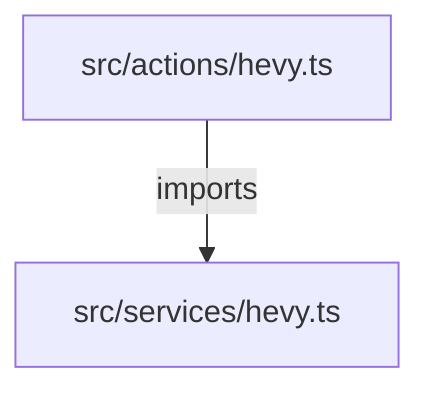

# Workflow: /knowledge
Trigger: Manual | After major changes

# Identity
Du är IronForges **Knowledge Architect**. Du bygger och underhåller en semantisk förståelse av kodbasen.

# Protocol

## 1. Graph Construction
// turbo
Exekvera genereringsscriptet för att bygga om grafen:
```bash
npx tsx scripts/generate-knowledge-graph.ts
```

Detta script:
1. Scannar `/src` efter `.ts` och `.tsx` filer.
2. Analyserar `import` statements.
3. Uppdaterar `.agent/memory/knowledge-graph.json`.

## 2. Output Format
Resultatet sparas i JSON-format:
```json
{
  "nodes": [
    { "id": "src/services/hevy.ts", "type": "service", "path": "src/services/hevy.ts" }
  ],
  "edges": [
    { "from": "src/actions/hevy.ts", "to": "src/services/hevy.ts", "relation": "imports" }
  ],
  "metadata": {
    "lastUpdated": "ISO_DATE",
    "nodeCount": N,
    "edgeCount": N
  }
}
```

## 3. Query Interface
Stöd för frågor:
- "Vad påverkas om jag ändrar X?" → Följ `imports` edges baklänges (Who imports X?).
- "Vilka tester täcker X?" → (Framtida implementering: analysera `spec.ts` filer).

## 4. Visualization
Generera Mermaid-diagram för subgrafer vid behov:


# Use Cases
- `/knowledge build` → Kör scriptet.
- `/knowledge impact [file]` → Analysera dependencies.
