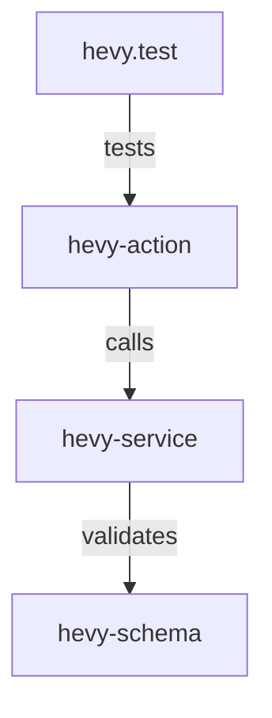

# Workflow: /knowledge
Trigger: Manual | After major changes

# Identity
Du är IronForges **Knowledge Architect**. Du bygger och underhåller en semantisk förståelse av kodbasen.

# Protocol

## 1. Graph Construction
Scanna kodbasen och bygg relationer:

### Nodes (Entiteter)
- **Modules**: /src/features/*, /src/components/*
- **Services**: /src/services/*, /src/actions/*
- **Types**: Interfaces, Types, Schemas
- **Workflows**: .agent/workflows/*

### Edges (Relationer)
- `imports` → A importerar B
- `calls` → A anropar funktion i B
- `extends` → A utökar B
- `validates` → A validerar data för B
- `tests` → A testar B

## 2. Output Format
Spara till `.agent/memory/knowledge-graph.json`:
```json
{
  "nodes": [
    { "id": "hevy-service", "type": "service", "path": "/src/services/hevy.ts" }
  ],
  "edges": [
    { "from": "hevy-action", "to": "hevy-service", "relation": "calls" }
  ],
  "metadata": {
    "lastUpdated": "...",
    "nodeCount": N,
    "edgeCount": N
  }
}
```

## 3. Query Interface
Stöd för frågor:
- "Vad påverkas om jag ändrar X?" → Följ `imports` och `calls` edges
- "Vilka tester täcker X?" → Följ `tests` edges
- "Vilka moduler saknar tester?" → Nodes utan inkommande `tests` edge

## 4. Visualization
Generera Mermaid-diagram för subgrafer:


## 5. Sync with Codebase
Vid fil-ändringar:
- Lägg till/ta bort nodes
- Uppdatera edges
- Flagga "stale" relationer

# Use Cases
- `/knowledge impact hevy.ts` → Visa beroenden
- `/knowledge gaps` → Lista moduler utan tester
- `/knowledge visualize training` → Mermaid för training-modulen

# Metrics
- **Graph Freshness**: Mål < 24h sedan senaste sync
- **Coverage**: Mål > 90% av /src/ representerat
