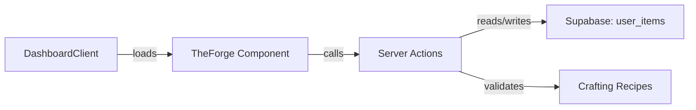

# 🏰 IronForge Architecture

**System Status:** `MIGRATED` (Next.js 16)
**Tech Stack:** `Next.js 16` (App Router) + `React 19` + `TypeScript`
**Type:** Full-Stack Web App (Server Actions + RSC)

---

## 🏗️ High-Level Overview
IronForge has successfully migrated to **Next.js 16**. The legacy Express proxy (`server.js`) has been decommissioned, and all API logic now resides in Next.js Route Handlers or Server Actions.

### Core Components
1.  **The Client (Forge UI):**
    *   **Framework:** Next.js 16 (App Router).
    *   **Entry Point:** `src/app/page.tsx` (Dashboard).
    *   **Styling:** Tailwind CSS + Framer Motion.
    *   **State:** Hybrid approach.
        *   **Server State:** Fetched via RSC / Server Actions.
        *   **Client State:** Zustand (for complex game stores like Inventory/Hero).

2.  **The API Layer (Route Handlers):**
    *   **Location:** `src/app/api/*`
    *   **Hevy Integration:** `src/app/api/hevy/*`
    *   **Intervals Integration:** `src/app/api/intervals/*` (via `src/lib/intervals.ts`)
    *   **Auth:** `src/app/auth/*` (Supabase SSR callback).
    *   **AI Oracle:** `src/app/api/chat/*` (Gemini integration).
    *   **Webhooks:** `src/app/api/webhooks/*` (Intervals/Hevy real-time updates).
    *   **Sync:** `src/app/api/sync/*` (Manual sync triggers).

3.  **The Bio-Engine (New):**
    *   **Purpose:** Tracks physiological data (FTP, HRV, Zones).
    *   **Source of Truth:** Intervals.icu.
    *   **Synchronization:** Server Actions (`syncBiometrics`) + Cron jobs.

4.  **Persistence Layer:**
    *   **DB:** Supabase (PostgreSQL).
    *   **ORM:** Prisma Client (`@prisma/client`).
    *   **Auth:** Supabase Auth Helpers (`@supabase/ssr`).

---

## 📁 Directory Structure
*   `/src/app`: Next.js App Router root.
    *   `api/`: Backend logic (Route Handlers).
    *   `auth/`: Authentication routes.
    *   `page.tsx`: Main entry.
*   `/src/components`: UI Building Blocks.
*   `/src/lib`: Shared utilities (Supabase client, Utils).
*   `/src/types`: TypeScript interfaces.
*   `/src/services`: **[LEGACY ADAPTERS]** converting to use internal API routes or Server Actions.

---

## ⚒️ The Forge (Crafting System)
**Location:** `src/features/game/TheForge.tsx`
**Server Actions:** `src/actions/inventory.ts`

### Purpose
The Forge is IronForge's in-game crafting system where players convert workout materials (Scrap) and currency (Gold) into equipment items with rarity tiers.

### Data Flow

### Key Types (`src/types/ironforge.ts`)
- `Item`: Equipment with id, name, rarity, stats, equipped flag
- `ItemRarity`: `common | rare | epic | legendary`
- `CraftingRecipe`: Requirements and output for crafting

### Integration Points
- **Dashboard:** Accessed via navigation from `DashboardClient.tsx`
- **Inventory:** Reads/writes to Supabase `user_items` table
- **Sound Effects:** Uses `playSound()` for crafting feedback

---

## 🛡️ Critical Design Patterns
1.  **Server-First:** ALWAYS prefer running logic on the server.
    *   Use **Server Actions** for mutations (saving data).
    *   Use **RSC** (React Server Components) for fetching initial data.
2.  **No Direct External Calls:** Never call Hevy/Intervals APIs directly from the client. Always tunnel through `src/app/api` or Server Actions to hide API Keys.
3.  **Supabase SSR:** Use `createClient` from `@supabase/ssr` in Server Components/Actions to handle auth cookies correctly.

---

## 🧹 Cleanup Status
*   `server.js`: **REMOVED** (Do not recreate).
*   `vite.config.ts`: **REMOVED** (Migration complete).
*   `react-router-dom`: **DEPRECATED** (Use Next.js `Link` and `useRouter`).
*   **Lint:** ✅ All errors resolved (2025-12-22).
*   **Build:** ✅ Compiles successfully.
*   **Tests:** ✅ 20/20 unit tests passing.

> **Rule:** All new development must strictly use Next.js paradigms. Do not fall back to Vite patterns.
