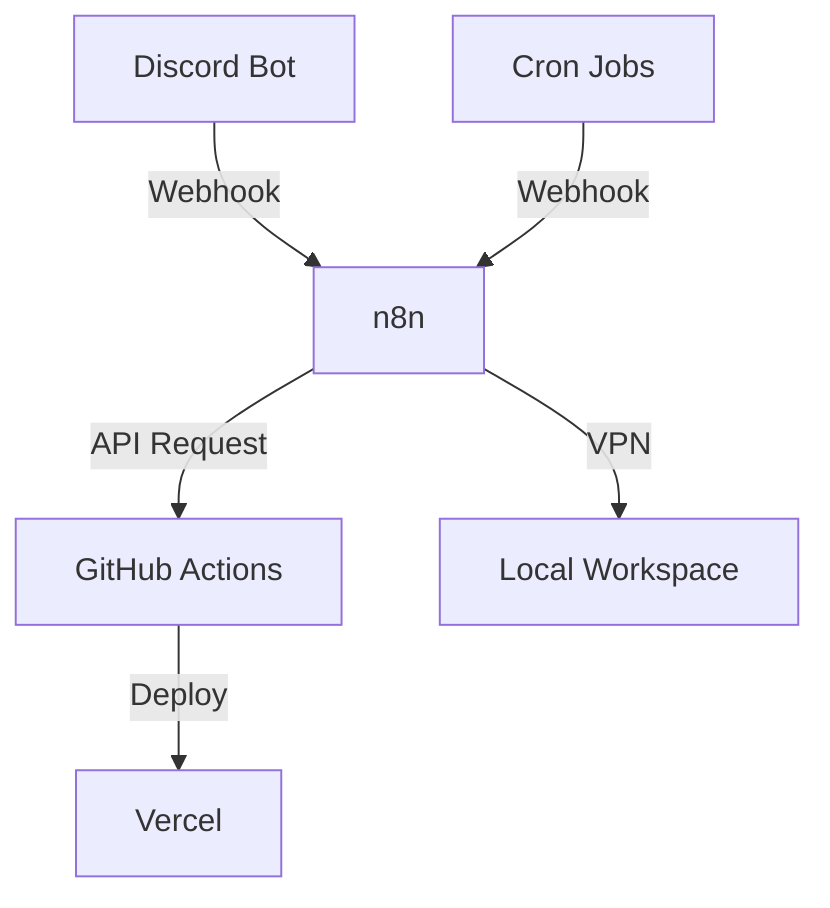

# 🏗️ IronForge Architecture & Standards

> **The North Star** for engineering decisions at IronForge. All agents and developers must adhere to these guidelines.

## 1. 🛠️ Tech Stack & Core Dependencies

| Layer | Technology | Version | Justification |
| :--- | :--- | :--- | :--- |
| **Framework** | Next.js (App Router) | 15.1+ | RSC standards, Streaming, Server Actions. |
| **Core** | React | 19.0+ | Actions, `useFormStatus`, `useOptimistic`. |
| **Language** | TypeScript | 5.0+ | Strict Mode required. No `any`. |
| **Database** | Supabase (Local CLI) | Latest | Full local stack (GoTrue, PostgREST, Realtime). |
| **ORM** | Prisma | 6.0+ | Type-safe DB access. |
| **Styling** | Tailwind CSS | 4.0 | Utility-first, v4 with @theme support. |
| **UI Primitive** | shadcn/ui | Latest | Radix-based accessible components. |
| **Validation** | Zod | 3.22+ | Runtime validation for ALL inputs. |

---

## 1.1 🎨 Titan Tech Design System (Tokens)

We utilize a semantic token system defined in `globals.css` to ensure consistency across the application.

| Token | Hex | Semantic Usage |
| :--- | :--- | :--- |
| `void` | `#030712` | Deep Space (Backgrounds) |
| `armor` | `#111827` | Hardened Steel (Cards, Surfaces) |
| `steel` | `#374151` | Structural (Borders, Muted Text) |
| `plasma` | `#f97316` | Action, Legendary Items, Primary Buttons |
| `warp` | `#a335ee` | Epic Items, High-Energy Effects |
| `gold` | `#eab308` | Artifacts, Warden Path, Accents |
| `clay` | `#c79c6e` | Classic UI, Parchment, Secondary Accents |
| `venom` | `#22c55e` | Restoration, Set Items, Success States |
| `crisis` | `#ef4444` | Failure, Cursed Items, Danger States |
| `emerald-glow`| `#10b981` | Titan Bio-Data, High-Level Mastery |
| `teal-glow`   | `#14b8a6` | Synthetic Neural Lattice, UI Accents |

---

## 2. 📂 Project Structure (Feature-First)

We follow a **Feature-based Architecture** to prevent "Drawer Structure" (separating files by type instead of domain).

```bash
src/
├── app/                  # Routing Layer only. Minimal logic.
│   ├── (auth)/           # Route Groups for layout segregation
│   ├── api/              # Webhooks only (Stripe/Cron). prefer Server Actions.
│   └── layout.tsx        # Root Layout (Providers)
│
├── features/             # 🧠 DOMAIN LOGIC (The Core)
│   ├── [feature-name]/   # e.g. "combat", "training", "onboarding"
│   │   ├── components/   # UI-components specific to this feature
│   │   ├── hooks/        # React hooks specific to this feature
│   │   ├── utils/        # Logic helpers specific to this feature
│   │   └── types.ts      # Domain-specific types
│   │   └── index.ts      # Public API for other features
│
├── components/           # 🧱 GENERIC UI (Atoms/Molecules)
│   ├── ui/               # shadcn/ui primitives (Button, Input)
│   └── shared/           # Reusable non-domain components (Layouts, Loaders)
│   ├── [!IMPORTANT]      # NO DOMAIN COMPONENTS HERE. Use features/[feature]/components.
│
├── actions/              # ⚡ SERVER ACTIONS (The API)
│   ├── [domain].ts       # e.g. "combat.ts", "auth.ts"
│   └── schemas/          # Zod schemas for action inputs (CRITICAL)
│
├── lib/                  # 🔌 CORE INFRASTRUCTURE
│   ├── prisma.ts         # Singleton DB client
│   ├── utils.ts          # Global helpers (cn, formatters)
│   └── auth.ts           # Authentication logic
│
└── services/             # 🦾 BUSINESS LOGIC / SERVICE LAYER
    ├── [service].ts      # Pure functions, no React dependency.
    └── adapter/          # External API Adapters (Strava/Hevy)
```

### 2.1 UI Architecture (Container/Presenter)

To ensure high testability (especially in tools like Storybook/Chromatic) and decouple data fetching from rendering, complex features follow the **Container/Presenter** pattern:

- **Container (`DashboardClient.tsx`)**: Responsible for fetching data, managing `useActionState`, global Zustand stores, and complex side-effects. It handles all business logic.
- **Presenter (`DashboardPresenter.tsx`)**: A pure, dumb component that strictly receives data via `props` and returns JSX. It handles all animations, styling, and visual logic, remaining completely devoid of network or database dependencies.

---

## 3. 🌊 Data Flow & Patterns

### 3.1 Server Actions (The Default "API")

DO NOT create standard API Routes (`/pages/api` or `route.ts`) unless strictly necessary (e.g. external webhooks).

1. **Input:** Component calls Server Action.
2. **Validation:** Action **MUST** validate input via Zod.
3. **Logic:** Action calls `prisma` or `services/`.
4. **Output:** Action returns `{ success: boolean, data?: T, error?: string }`.

### 3.2 React Server Components (RSC)

- **Default:** All components are Server Components by default.
- **Fetch:** Fetch data directly in the RSC using Prisma or Service.
- **Client Boundary:** Use `'use client'` ONLY for interactivity (Inputs, Buttons, Hooks). Push Client Components down the tree ("Leaf Nodes").

### 3.3 State Management

- **Server State:** URL Search Params + Server Actions (revalidatePath).
- **Global Client State:** Zustand (Use sparingly).
- **Form State:** `useActionState` (React 19) or standard controlled inputs.

---

## 4. 🛡️ Security & Reliability

### 4.1 Zero-Trust Input

- **Never trust the client.**
- Every Server Action must start with `props = schema.parse(input)`.

### 4.2 Error Handling

- **User Facing:** UI must handle errors gracefully (Toast notifications).
- **System:** Log critical errors to Sentry (via `lib/logger` or direct import).

### 4.3 Database Guardrails

- **No "God Objects":** Avoid adding fields to `User` unless absolutely generic. Use specific tables (`UserMetrics`, `UserSettings`) linked by ID.
- **Indexes:** Ensure foreign keys and frequently queried fields are indexed.

---

## 5. 🧪 Testing Strategy

| Type | Tool | Scope | Command |
| :--- | :--- | :--- | :--- |
| **Unit** | Vitest | Utils, Services, Hooks, complex Logic. | `npm test` |
| **Integration** | Vitest | Server Actions (mocked DB). | `npm test` |
| **E2E** | Playwright | Critical User Flows (Login, Combat, Checkout). | `npm run test:e2e` |

---

## 6. 🎮 Game Mechanics & Progression

IronForge treats physical training as the primary game engine. Progression is deterministic and tied to real-world performance.

### 6.1 Training Paths (The Pillars)

- **Purpose:** Defines the athlete's specialization (Juggernaut, Pathfinder, Warden).
- **Logic:** Modifies combat stats, volume targets, and reward weights.
- **Parallel Tracks:** "Passive Layers" (Mobility & Recovery) provide long-term risk reduction.

### 6.2 Neural Lattice (Passive Mastery)

- **Structure:** A PoE-inspired non-linear skill tree.
- **Currencies:** Talent Points (TP) from action, Kinetic Shards (KS) from recovery.
- **Gatekeeping:** Highly impactful "Keystones" define playstyles but come with significant trade-offs and physical prerequisites (e.g., 1RM targets).

### 6.3 Goal-Priority- [Identity & Persona](file:///c:/Users/alexa/Workspaces/IronForge/IDENTITY.md): Defines the core purpose and ethics of IronForge

- [Secret Management Protocol](file:///c:/Users/alexa/Workspaces/IronForge/docs/SECRET_MANAGEMENT.md): Documentation on Doppler-first secret handling and token naming conventions.

- [Daily Brief](file:///c:/Users/alexa/Workspaces/IronForge/DAILY_BRIEF.md): Tracks high-level progress.
 Macro-Phases (Build/Peak/Deload) to resolve interference.

- **Tactical Layer:** `TrainingCalendar` generates week plans based on `DailyReadiness` and `ResourceBudget` (CNS/Metabolic/Muscular).
- **Motivation:** Integrated "Motivation Engine" (Streaks, PvP, Progression Transparency) ensures adherence via psychological hooks.
- **Bio-Safeguards:** Hard-coded triggers (ACWR, HRV, Sleep) enforce deloads regardless of user ambition.

---

## 8. 🌩️ Remote Trigger Infrastructure

IronForge uses a hybrid cloud/local infrastructure for autonomous agent workflows and remote triggering.

### 8.1 Architecture Overview


```mermaid
graph TD
    A[Discord Bot] -->|Webhook| B[n8n]
    C[Cron Jobs] -->|Webhook| B
    B -->|API Request| D[GitHub Actions]
    D -->|Deploy| E[Vercel]
    B -->|VPN| F[Local Workspace]
```

### 8.2 Components

| Component | Technology | Role |
| :--- | :--- | :--- |
| **Orchestration** | n8n | Webhook receiver and workflow router. |
| **Secure Access** | Tailscale | VPN layer for accessing private VPS services. |
| **Deployment** | Coolify | Self-hosted PaaS on Hetzner VPS for n8n and bots. |
| **Trigger Interface** | Discord Bot | Interaction layer for triggering workflows (e.g., `/ironforge`). |
| **Auth** | Shared Secret | `REMOTE_TRIGGER_SECRET` validates webhook payloads. |

### 8.3 Standard Workflows

- **Health Check**: Triggered remotely to verify system status.
- **Night Shift**: Autonomous maintenance (dependency updates, linting).
- **Deploy**: Manual override for production deployments.

---

## 9. 🚀 Deployment & CI/CD

IronForge implements a **Tiered CI/CD Architecture** to balance rapid developer feedback (L1) with rigorous production assurance (L2/L3). All deployments are handled via **Coolify** on self-hosted infrastructure.

### 9.1 CI/CD Tiers

| Tier | Objective | Trigger | Scope | SLA |
| :--- | :--- | :--- | :--- | :--- |
| **L1: Fast Feedback** | Logic & Syntax | Pull Request | `Lint`, `Type Check`, `Unit Tests` (Differential) | < 5m |
| **L2: Verification** | Build & Smoke | Push to `main` | `Full Build`, `E2E Smoke`, `Perf Audit`, `DB Drift` | < 15m |
| **L3: Assurance** | Security & Depth | Nightly (Cron) | `Exhaustive E2E`, `Snyk Security Audit`, `Sentry Hygiene` | Daily |
| **🤖 Jules Mission** | AI-Agent Coding | Manual/Push | `Remote Code Execution`, `PR Feedback`, `Autonomous Fixes` | Async |

### 9.2 Security Auditing (Snyk)

We use **Snyk** as our primary security gate in Layer 3.

- **Coverage**: Scans 1st party code and 3rd party dependencies.
- **Enforcement**: Integrated into `nightly-maintenance.yml`.
- **Reporting**: Results are logged to the GitHub Security tab and workflow summaries.

### 9.3 Deployment (Coolify)

- **Production**: Publishing a GitHub Release triggers a Coolify webhook via `coolify-deploy.yml`. Manual deploys can also be triggered via `workflow_dispatch`.
- **Infrastructure**: Hosted on Hetzner VPS (managed via Tailscale).
- **Rollbacks**: Automated via Sentry alerts (`sentry-rollback.yml`) if error rates spike.

### 9.4 Titan-Tier Governance (10/10)

The CI/CD pipeline is **self-healing** and enforced via automated governance.

- **Workflow Linter**: The `governance-guard.yml` workflow audits all PRs to ensure environment parity (Node 22, pnpm 9, `actions/checkout@v4`).
- **Modular Setup**: All workflows use `uses: ./.github/actions/setup-ironforge` to ensure a single source of truth for repository initialization.
- **Pre-flight Validation**: Critical flows include a `pre-flight` job (`validate-secrets.ps1`) that fails fast if required environment secrets are missing, preventing redundant runner usage.

> [!IMPORTANT]
> Always verify that `pnpm agent:verify` passes locally before pushing. This command runs a hybrid L1/L2 check.

---

## 10. 📹 Remotion Programmatic Video

Programmatic video is a core component of the IronForge sharing ecosystem, enabling players to export high-quality, data-driven clips of their workouts and PvP duels.

### 10.1 Core Concepts

- **Framework**: `remotion` (React-based programmatic video).
- **Location**: All video-related code is co-located in `src/remotion/`.
- **Compositions**: Video templates are defined as `Composition` components in the `Root.tsx` file.
- **Data Hydration**: Video components accept strictly typed data objects via `defaultProps` and `getInputProps()`, ensuring safe generation pipelines in CI and on the backend.

### 10.2 Workflow / Pipeline

1. **User Action**: The user completes an activity (e.g., Weekly Recap, Titan Level-up).
2. **Data Assembly**: The UI queries the `TitanService` and compiles the necessary video properties (`fps`, `durationInFrames`, and the payload).
3. **Render Initiation**: Triggering a share calls a dedicated Server Action or Next.js route that leverages `@remotion/lambda` (in production) to render the video.
4. **Delivery**: The resulting MP4 is uploaded to the CDN and served to the user for social media sharing.
