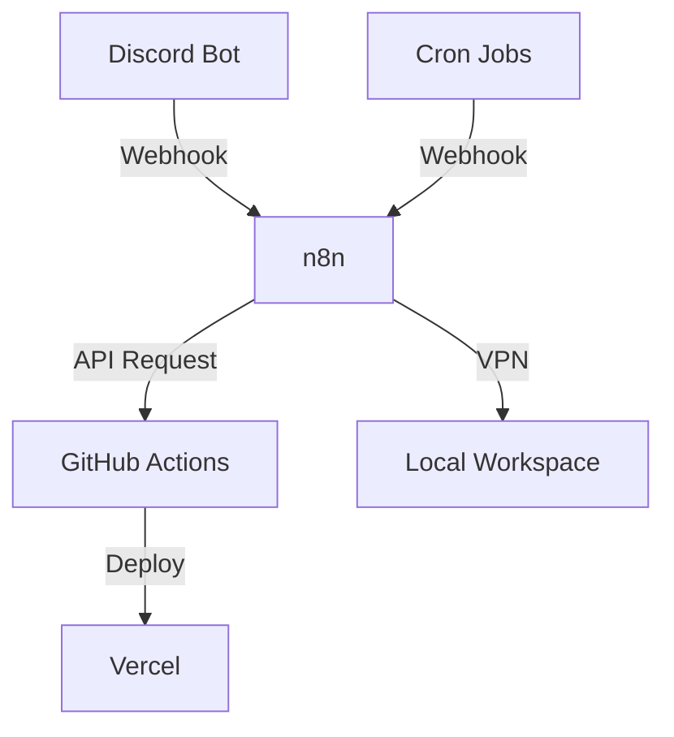

# 🏗️ IronForge Architecture & Standards

> **The North Star** for engineering decisions at IronForge. All agents and developers must adhere to these guidelines.

## 1. 🛠️ Tech Stack & Core Dependencies

| Layer | Technology | Version | Justification |
| :--- | :--- | :--- | :--- |
| **Framework** | Next.js (App Router) | 15.1+ | RSC standards, Streaming, Server Actions. |
| **Core** | React | 19.0+ | Actions, `useFormStatus`, `useOptimistic`. |
| **Language** | TypeScript | 5.0+ | Strict Mode required. No `any`. |
| **Database** | PostgreSQL | Latest | Relational integrity for RPG data. |
| **ORM** | Prisma | 6.0+ | Type-safe DB access. |
| **Styling** | Tailwind CSS | 3.3+ | Utility-first, co-located styles. |
| **UI Primitive** | shadcn/ui | Latest | Radix-based accessible components. |
| **Validation** | Zod | 3.22+ | Runtime validation for ALL inputs. |

---

## 2. 📂 Project Structure (Feature-First)

We follow a **Feature-based Architecture** to prevent "Drawer Structure" (separating files by type instead of domain).

```
src/
├── app/                  # Routing Layer only. Minimal logic.
│   ├── (auth)/           # Route Groups for layout segregation
│   ├── api/              # Webhooks only (Stripe/Cron). prefer Server Actions.
│   └── layout.tsx        # Root Layout (Providers)
│
├── features/             # 🧠 DOMAIN LOGIC (The Core)
│   ├── [feature-name]/   # e.g. "combat", "training", "onboarding"
│   │   ├── components/   # UI-components specific to this feature
│   │   ├── hooks/        # React hooks specific to this feature
│   │   ├── utils/        # Logic helpers specific to this feature
│   │   └── types.ts      # Domain-specific types
│   │   └── index.ts      # Public API for other features
│
├── components/           # 🧱 GENERIC UI (Atoms/Molecules)
│   ├── ui/               # shadcn/ui primitives (Button, Input)
│   └── shared/           # Reusable non-domain components (Layouts, Loaders)
│   ├── [!IMPORTANT]      # NO DOMAIN COMPONENTS HERE. Use features/[feature]/components.
│
├── actions/              # ⚡ SERVER ACTIONS (The API)
│   ├── [domain].ts       # e.g. "combat.ts", "auth.ts"
│   └── schemas/          # Zod schemas for action inputs (CRITICAL)
│
├── lib/                  # 🔌 CORE INFRASTRUCTURE
│   ├── prisma.ts         # Singleton DB client
│   ├── utils.ts          # Global helpers (cn, formatters)
│   └── auth.ts           # Authentication logic
│
└── services/             # 🦾 BUSINESS LOGIC / SERVICE LAYER
    ├── [service].ts      # Pure functions, no React dependency.
    └── adapter/          # External API Adapters (Strava/Hevy)
```

---

## 3. 🌊 Data Flow & Patterns

### 3.1 Server Actions (The Default "API")

DO NOT create standard API Routes (`/pages/api` or `route.ts`) unless strictly necessary (e.g. external webhooks).

1. **Input:** Component calls Server Action.
2. **Validation:** Action **MUST** validate input via Zod.
3. **Logic:** Action calls `prisma` or `services/`.
4. **Output:** Action returns `{ success: boolean, data?: T, error?: string }`.

### 3.2 React Server Components (RSC)

* **Default:** All components are Server Components by default.
* **Fetch:** Fetch data directly in the RSC using Prisma or Service.
* **Client Boundary:** Use `'use client'` ONLY for interactivity (Inputs, Buttons, Hooks). Push Client Components down the tree ("Leaf Nodes").

### 3.3 State Management

* **Server State:** URL Search Params + Server Actions (revalidatePath).
* **Global Client State:** Zustand (Use sparingly).
* **Form State:** `useActionState` (React 19) or standard controlled inputs.

---

## 4. 🛡️ Security & Reliability

### 4.1 Zero-Trust Input

* **Never trust the client.**
* Every Server Action must start with `props = schema.parse(input)`.

### 4.2 Error Handling

* **User Facing:** UI must handle errors gracefully (Toast notifications).
* **System:** Log critical errors to Sentry (via `lib/logger` or direct import).

### 4.3 Database Guardrails

* **No "God Objects":** Avoid adding fields to `User` unless absolutely generic. Use specific tables (`UserMetrics`, `UserSettings`) linked by ID.
* **Indexes:** Ensure foreign keys and frequently queried fields are indexed.

---

## 5. 🧪 Testing Strategy

| Type | Tool | Scope | Command |
| :--- | :--- | :--- | :--- |
| **Unit** | Vitest | Utils, Services, Hooks, complex Logic. | `npm test` |
| **Integration** | Vitest | Server Actions (mocked DB). | `npm test` |
| **E2E** | Playwright | Critical User Flows (Login, Combat, Checkout). | `npm run test:e2e` |

---

## 6. 🎮 Game Mechanics & Progression

IronForge treats physical training as the primary game engine. Progression is deterministic and tied to real-world performance.

### 6.1 Training Paths (The Pillars)

* **Purpose:** Defines the athlete's specialization (Juggernaut, Pathfinder, Warden).
* **Logic:** Modifies combat stats, volume targets, and reward weights.
* **Parallel Tracks:** "Passive Layers" (Mobility & Recovery) provide long-term risk reduction.

### 6.2 Neural Lattice (Passive Mastery)

* **Structure:** A PoE-inspired non-linear skill tree.
* **Currencies:** Talent Points (TP) from action, Kinetic Shards (KS) from recovery.
* **Gatekeeping:** Highly impactful "Keystones" define playstyles but come with significant trade-offs and physical prerequisites (e.g., 1RM targets).

### 6.3 Goal-Priority Engine (The Brain)

* **Strategy:** Replaces high-overhead AI with deterministic periodization focus.
* **Mechanic:** Users declare & prioritize goals. Engine rotates Macro-Phases (Build/Peak/Deload) to resolve interference.
* **Tactical Layer:** `TrainingCalendar` generates week plans based on `DailyReadiness` and `ResourceBudget` (CNS/Metabolic/Muscular).
* **Motivation:** Integrated "Motivation Engine" (Streaks, PvP, Progression Transparency) ensures adherence via psychological hooks.
* **Bio-Safeguards:** Hard-coded triggers (ACWR, HRV, Sleep) enforce deloads regardless of user ambition.

---

## 8. 🌩️ Remote Trigger Infrastructure

IronForge uses a hybrid cloud/local infrastructure for autonomous agent workflows and remote triggering.

### 8.1 Architecture Overview


```mermaid
graph TD
    A[Discord Bot] -->|Webhook| B[n8n]
    C[Cron Jobs] -->|Webhook| B
    B -->|API Request| D[GitHub Actions]
    D -->|Deploy| E[Vercel]
    B -->|VPN| F[Local Workspace]
```

### 8.2 Components

| Component | Technology | Role |
| :--- | :--- | :--- |
| **Orchestration** | n8n | Webhook receiver and workflow router. |
| **Secure Access** | Tailscale | VPN layer for accessing private VPS services. |
| **Deployment** | Coolify | Self-hosted PaaS on Hetzner VPS for n8n and bots. |
| **Trigger Interface** | Discord Bot | Interaction layer for triggering workflows (e.g., `/ironforge`). |
| **Auth** | Shared Secret | `REMOTE_TRIGGER_SECRET` validates webhook payloads. |

### 8.3 Standard Workflows

* **Health Check**: Triggered remotely to verify system status.
* **Night Shift**: Autonomous maintenance (dependency updates, linting).
* **Deploy**: Manual override for production deployments.

---

## 9. 🚀 Deployment & CI/CD

IronForge is deployed to **Vercel** with full automation via **GitHub Actions**.

### 7.1 Pipeline Overview

1. **Verify & Quality Gate (`ci-cd.yml`)**: Triggered on all Pull Requests and pushes to `main`. Runs Lint, Vitest (Unit/Integration), Playwright (E2E), and DB Drift checks. Uses Turborepo Caching.
2. **Production Deploy (`ci-cd.yml`)**: Automated deployment to Vercel triggered on successful build/merge to the `main` branch.

### 7.2 Custom Domains

* **Production**: [ironforge.app](https://ironforge.app)

* **Staging/Preview**: Automatic Vercel Preview URLs for all PRs.

### 7.3 Essential Secrets (GitHub & Vercel)

The following secrets must be synchronized between GitHub Actions and Vercel:

* `DATABASE_URL`: Production PostgreSQL connection string.
* `NEXT_PUBLIC_SUPABASE_URL` / `ANON_KEY`: Auth and Storage.
* `SENTRY_DSN`: Error tracking (Production).
* `VERCEL_TOKEN`, `VERCEL_ORG_ID`, `VERCEL_PROJECT_ID`: Required for CLI-based deployment triggers if standard GitHub hooks are disabled.

> [!IMPORTANT]
> Always verify that `npm run agent:verify` passes locally before pushing to `main`.
