# Antigravity Quota Strategy

This document explains how IronForge leverages Antigravity's native quota system for autonomous workflows, eliminating the need for custom Gemini API keys and quota tracking.

## Overview

The `ironforge-factory-mcp` server integrates with Antigravity to execute autonomous workflows using Antigravity's enterprise-level quota instead of custom API quotas. This provides:

- **Higher limits**: Antigravity has significantly higher quota than custom API keys (10,000+ vs 1,500 RPD)
- **No cost**: Uses Google's infrastructure without billing to your account
- **Automatic management**: Antigravity handles quota tracking and rate limiting internally
- **Seamless integration**: Works through MCP (Model Context Protocol) for clean separation of concerns

## Architecture

```mermaid
graph TD
    A[GitHub Actions] -->|workflow_dispatch| B[Self-Hosted Runner]
    B -->|Check availability| C{Antigravity Available?}
    C -->|Yes| D[Write task signal to .agent/tasks/current.md]
    C -->|No| E[Fallback to GitHub Actions workflow_dispatch]
    D -->|Antigravity picks up| F[Execute workflow via Antigravity]
    F -->|Uses| G[Antigravity's Native Quota]
    E -->|Triggers| H[Standard autonomous workflow]
    H -->|Uses| I[GitHub-hosted runner]
```



## How It Works

### 1. Trigger Request

When a workflow needs to be executed (e.g., `/night-shift`, `/cleanup`), the request can come from:

- Manual trigger via GitHub Actions UI
- Scheduled cron job
- External system (n8n, Coolify)
- Direct MCP tool call from Antigravity

### 2. Availability Check

The `ironforge-factory-mcp` server checks if Antigravity is available by:

- Verifying the `.agent/tasks` directory exists
- Checking MCP server connectivity (future enhancement)

### 3. Execution Path

#### Path A: Antigravity Available ✅

1. MCP server writes a task signal to `.agent/tasks/current.md`
2. Task signal includes:
   - Workflow name (e.g., `night-shift`)
   - Model to use (e.g., `gemini-2.5-flash`)
   - Trigger timestamp and context
3. Antigravity picks up the task signal
4. Antigravity executes the workflow using its native quota
5. Usage is tracked for monitoring (not enforcement)

#### Path B: Antigravity Unavailable ⚠️

1. MCP server falls back to GitHub Actions `workflow_dispatch`
2. Triggers the corresponding autonomous workflow file
3. Workflow runs on GitHub-hosted runner (or self-hosted without Antigravity)
4. Uses standard GitHub Actions execution

## Quota Tracking

The MCP server maintains a quota tracking file at `.agent/quota_usage.json` for **monitoring purposes only**:

```json
{
  "date": "2026-02-16",
  "count": 42
}
```

**Important**: This tracking does NOT enforce quota limits. Antigravity manages its own quota internally. The tracking file is used for:

- Analytics and usage visibility
- Monitoring workflow execution frequency
- Historical data for optimization

### Quota Status

The `get_quota_status` MCP tool returns:

```
📊 Antigravity Quota Status (Monitoring)

Source: antigravity
Status: Healthy
Used Today: 42
Remaining: 9958
Usage: 0%

Note: This is for monitoring only. Antigravity manages its own quota system with enterprise-level limits.
```

## Benefits

### vs. Custom Gemini API Key

| Feature | Antigravity Quota | Custom API Key |
|---------|-------------------|----------------|
| **Daily Limit** | 10,000+ requests | 1,500 requests |
| **Cost** | Free (Google infrastructure) | Billed to your account |
| **Management** | Automatic | Manual tracking required |
| **Integration** | Native MCP | Custom implementation |
| **Reliability** | Enterprise SLA | Consumer tier |

### vs. GitHub Actions Only

| Feature | Antigravity + GitHub Actions | GitHub Actions Only |
|---------|------------------------------|---------------------|
| **Quota** | Antigravity's enterprise quota | GitHub Actions minutes |
| **Execution** | Local with full context | Remote, limited context |
| **Speed** | Faster (local) | Slower (cold start) |
| **Flexibility** | Can use both | Limited to GitHub |

## Usage Examples

### From Antigravity Chat

Simply call the MCP tool:

```
Use the trigger_autonomous_workflow tool with:
- workflow: "night-shift"
- model: "gemini-2.5-flash"
```

Antigravity will:

1. Call the `ironforge-factory-mcp` server
2. Server writes task signal
3. Antigravity picks up and executes using its quota

### From GitHub Actions

Trigger the workflow manually or via API:

```yaml
- name: Trigger Night Shift
  uses: actions/github-script@v7
  with:
    script: |
      await github.rest.actions.createWorkflowDispatch({
        owner: 'Techlemariam',
        repo: 'IronForge',
        workflow_id: 'autonomous-antigravity-trigger.yml',
        ref: 'main',
        inputs: {
          workflow: 'night-shift',
          model: 'gemini-2.5-flash'
        }
      });
```

### From External Systems (n8n)

Use the GitHub Actions API to trigger:

```javascript
// n8n HTTP Request node
{
  "method": "POST",
  "url": "https://api.github.com/repos/Techlemariam/IronForge/actions/workflows/autonomous-antigravity-trigger.yml/dispatches",
  "headers": {
    "Authorization": "Bearer {{ $env.GITHUB_TOKEN }}",
    "Accept": "application/vnd.github+json"
  },
  "body": {
    "ref": "main",
    "inputs": {
      "workflow": "night-shift",
      "model": "gemini-2.5-flash"
    }
  }
}
```

## Monitoring

### Check Quota Status

From Antigravity, use the MCP tool:

```
Call get_quota_status tool
```

### View Task Signals

Check the task signal file:

```powershell
Get-Content .agent\tasks\current.md
```

### Monitor Workflow Execution

GitHub Actions logs show:

- Antigravity availability check
- Task signal creation
- Fallback triggers (if any)
- Execution monitoring

## Troubleshooting

### Task Signal Not Picked Up

**Symptoms**: Task file remains in `.agent/tasks/current.md` for extended period

**Solutions**:

1. Check if Antigravity is running
2. Verify MCP server is registered in `mcp_config.json`
3. Restart Antigravity to reload MCP servers
4. Check Antigravity logs for errors

### Fallback Always Triggered

**Symptoms**: Always falls back to GitHub Actions, never uses Antigravity

**Solutions**:

1. Verify `.agent/tasks` directory exists
2. Check self-hosted runner has access to project directory
3. Ensure MCP server is built: `cd mcp/factory-server && npm run build`
4. Verify `mcp_config.json` includes `ironforge-factory` entry

### Quota Tracking Shows High Usage

**Symptoms**: Quota usage approaching 10,000

**Note**: This is monitoring only, not enforcement. Antigravity will continue to work.

**Actions**:

1. Review which workflows are running most frequently
2. Consider optimizing workflow triggers
3. Check for infinite loops or excessive retries

## Future Enhancements

- [ ] Direct MCP-to-MCP communication for health checks
- [ ] Real-time quota status from Antigravity API
- [ ] Automatic workflow prioritization based on quota
- [ ] Integration with n8n for advanced orchestration
- [ ] Webhook endpoints for external triggers
