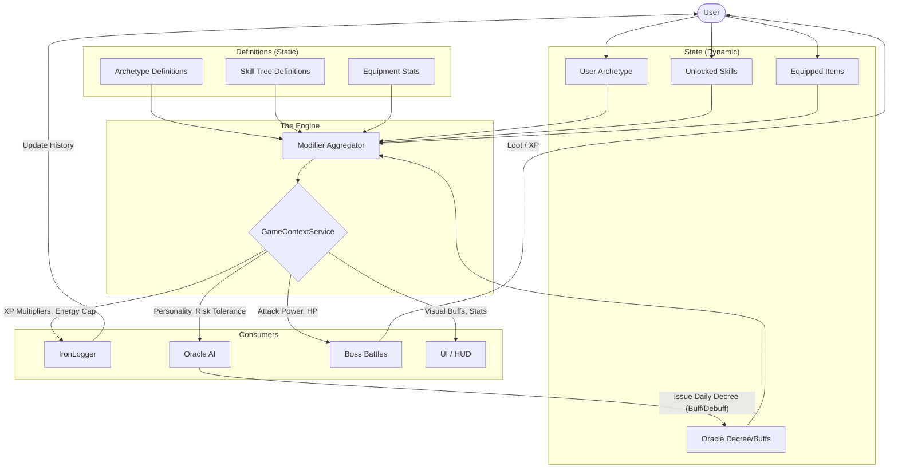

# 🏗️ The IronForge Game Loop Architecture

> **Objective:** Unify Archetypes, Skill Tree, IronLogger, and Oracle into a single cohesive "Game Loop" where every action impacts the ecosystem.

## 🔗 The Missing Link: `GameContextService`

Currently, `TrainingContextService` calculates *physiologic* state, but we lack a unified service that calculates *gameplay* state (modifiers, buffs, perks).

We propose a new **Unified Modifier System** that aggregates sources of power into a single calculated snapshot.

### 🔄 The Cycle



---

## 🧩 1. The `PlayerContext` Object

This object is the "Source of Truth" for any system asking "How strong is this user right now?".

```typescript
// src/types/game.ts

export interface PlayerContext {
  identity: {
    archetype: Archetype; // JUGGERNAUT | PATHFINDER | WARDEN
    classTitle: string;   // e.g. "Iron Juggernaut"
    level: number;
  };
  
  // Calculated Modifiers (Base 1.0)
  modifiers: {
    xpGain: number;          // Global XP Multiplier
    strengthXp: number;      // Specific multiplier for Strength actions
    cardioXp: number;        // Specific multiplier for Cardio actions
    recoverySpeed: number;   // Modifies TSB calculation
    mrvScale: number;        // Increases Volume Capacity
    bossDamage: number;      // Combat damage multiplier
    lootLuck: number;        // Drop rate modifier
  };

  // Active Effects
  activeBuffs: Array<{
    source: "ORACLE" | "SKILL" | "ITEM";
    name: string;
    description: string;
    expiresAt?: Date;
  }>;
}
```

---

## 🛠️ 2. Integration Points

### A. Skill Tree → Game Context
**Concept:** Skills are no longer just "badges"; they are **passive modifier packets**.

*   **Example Skill:** `Barbell Mastery`
    *   *Effect:* +10% Strength XP, +5% Boss Damage on Leg Push days.
*   **Implementation:**
    *   Create a `SkillEffect` definition in `static.ts`.
    *   `GameContextService` loads unlocked skills and sums up the effects.

### B. IronLogger Integration
**Concept:** The Logger asks the Context "What are the rewards?" before saving.

*   **Before:** `Base XP = Volume / 100`
*   **After:**
    ```typescript
    const context = await GameContextService.getPlayerContext(userId);
    let xp = (volume / 100) * context.modifiers.strengthXp;
    
    // Skill Trigger Check
    if (exercise.isBarbell && context.hasSkill("BARBELL_MASTERY")) {
        xp *= 1.1; 
        log.addNote("Barbell Mastery Bonus Applied!");
    }
    ```

### C. Oracle Integration
**Concept:** The Oracle uses the Context to "Roleplay" the Dungeon Master.

*   **Prompt Injection:**
    *   "You are speaking to a Level 12 **Juggernaut**. They currently have the **'Overreached'** debuff but possess the **'Iron Will'** skill."
    *   "Because they are a Juggernaut, praise their Heavy Volume but warn about their poor Cardio."

*   **Daily Decree:**
    *   The Oracle has the power to write to the `User` DB to set a `dailyDecree`.
    *   This Decree is read by `GameContextService` to apply a localized buff (e.g., "The Oracle demands a PR today: +20% Boss Damage").

---

## 🚀 Implementation Strategy

1.  **Phase 1: The Context Service**
    *   Create `src/services/game/GameContextService.ts`.
    *   Implement `getPlayerContext(userId)`.
    *   Define `SkillEffects` in data files.

2.  **Phase 2: Logger Connection**
    *   Refactor `logExerciseSetsAction` in `logger.ts` to call `getPlayerContext`.
    *   Store `appliedBuffs` in the `ExerciseLog` (requires JSON field) or just the final calculated XP.

3.  **Phase 3: Oracle Loop**
    *   Update `OracleChat` to inject `PlayerContext` into the System Prompt.
    *   Allow Oracle to "Call Tools" to set buffs (Function Calling).

## ❓ What You Missed (Potential Additions)

1.  **Territory Bonuses:**
    *   If you implement the "Conquest" map, owning specific zones (e.g., "The Iron Mines") could provide global buffs (e.g., "+5% Strength MRV").
    *   *Add to Context:* `modifiers.territoryBonus`.

2.  **Equipment/Loot:**
    *   You have a Store/Forge. Items should have stats.
    *   *Add to Context:* `modifiers.equipmentStats`.

3.  **Consumables:**
    *   "Pre-workout" potion in-game?
    *   Temporary 1-hour buffs tracked in Redis/DB.

This architecture ensures that **everything connects to everything** through the central hub of `PlayerContext`.
