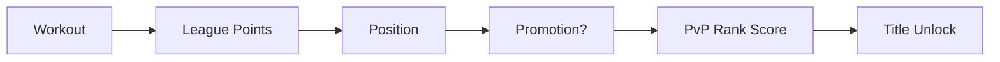

# Iron Leagues Analysis

> Veckovisa ligor med promotion/relegation inspirerat av Clash Royale och FIFA Division Rivals.

## Koncept

Spelare placeras i ligor med ~20-30 andra av liknande nivå. Varje vecka tjänar de poäng baserat på träning. Top 15% går upp, bottom 15% går ner.

## Platform Matrix

| Aspect | Desktop | Mobile | TV Mode | Companion |
|:-------|:--------|:-------|:--------|:----------|
| **Primary?** | ✅ | ✅ | ⚠️ | ❌ |
| **Layout** | Full table + graphs | Ranked list | Position badge only | N/A |
| **Input** | Click to expand | Tap to expand | View only | N/A |
| **Offline?** | No | Cached standings | No | N/A |
| **Priority** | P0 | P0 | P2 | N/A |

**Notes:**
- Mobil: Fokus på din position och +/- från förra veckan
- TV Mode: Visa bara "🏆 Gold II - Rank #7" som badge i HUD
- Desktop: Full leaderboard med grafer över tid

## League Tiers

```
🏆 Legend     (Top 50 globalt)
⚔️ Champion   (I, II)
👑 Diamond    (I, II, III)
💎 Platinum   (I, II, III, IV)
🥇 Gold       (I, II, III, IV)
🥈 Silver     (I, II, III, IV)
🥉 Bronze     (I, II, III, IV)
```

## Scoring Formula

```typescript
weeklyLeaguePoints = (
  workoutCount * 100 +      // Base: show up
  totalVolume / 100 +       // Volume
  totalTSS * 2 +            // Cardio (TSS)
  prCount * 500 +           // PRs
  streakBonus               // Consistency
);
```

## Database Schema

```prisma
model League {
  id          String   @id @default(cuid())
  name        String   // "Gold III - Week 52"
  division    String   // BRONZE → LEGEND
  tier        Int      // 1-4
  weekNumber  Int
  year        Int
  isActive    Boolean  @default(true)
  members     LeagueMembership[]
}

model LeagueMembership {
  id           String   @id @default(cuid())
  userId       String
  leagueId     String
  weeklyPoints Int      @default(0)
  position     Int?
  result       String?  // PROMOTED, STAYED, RELEGATED
  
  user         User     @relation(fields: [userId], references: [id])
  league       League   @relation(fields: [leagueId], references: [id])
  
  @@unique([userId, leagueId])
}
```

## Weekly Cycle (Cron Jobs)

| Day | Time (UTC) | Action |
|:----|:-----------|:-------|
| Mon | 00:00 | Calculate final positions, process promotions/relegations |
| Mon | 00:01 | Create new league instances, assign players |
| Mon | 00:05 | Send push notifications ("New week!") |
| Sun | 23:00 | Send reminder ("24h left!") |

## Anti-Abuse

- **Inactivity**: 0 workouts = auto-relegation
- **2 week absence**: Dropped to Bronze IV
- **Smurf prevention**: New users start in Bronze, can't skip tiers

## Integration



## Implementation Steps

1. Add `League` and `LeagueMembership` models to Prisma
2. Create `leagueService.ts` with scoring and placement logic
3. Add cron job for weekly reset (Vercel Cron or GitHub Actions)
4. Create `LeagueStanding.tsx` UI component
5. Add to Social Hub navigation
