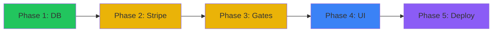

# IronForge Monetization System

A comprehensive implementation plan for Lifetime Access and Subscription-based monetization.

## Current State Analysis

### ✅ Already Implemented
| Component | Location | Status |
|-----------|----------|--------|
| `SubscriptionTier` enum | [schema.prisma](file:///c:/Users/alexa/Workspaces/IronForge/prisma/schema.prisma#L190-194) | `FREE`, `PRO`, `LIFETIME` |
| User subscription fields | [schema.prisma](file:///c:/Users/alexa/Workspaces/IronForge/prisma/schema.prisma#L49-51) | `subscriptionTier`, `subscriptionStatus`, `subscriptionExpiry` |
| XP Multiplier bonus | [progression.ts](file:///c:/Users/alexa/Workspaces/IronForge/src/services/progression.ts#L202) | +10% for PRO/LIFETIME |
| Admin scripts | [scripts/](file:///c:/Users/alexa/Workspaces/IronForge/scripts/) | `grant-lifetime.ts`, `force-create-lifetime.ts` |

### ❌ Missing Components
- Payment provider integration (Stripe/Paddle)
- Checkout UI flow
- Webhook handlers for subscription events
- Feature gates for premium features
- Subscription management UI
- Receipt/invoice system

---

## User Review Required

> [!IMPORTANT]
> **Provider Choice**: Stripe vs Paddle vs Lemon Squeezy
> - **Stripe**: Industry standard, excellent DX, but requires merchant registration and VAT handling
> - **Paddle**: "Merchant of Record" - handles VAT/taxes globally, simpler compliance
> - **Lemon Squeezy**: Similar to Paddle, better indie-dev pricing
> 
> **Recommendation**: Paddle for solo devs (no VAT headaches), Stripe for enterprise control.

> [!WARNING]
> **Breaking Changes**
> - User table will get new fields: `stripeCustomerId`, `stripeSubscriptionId`
> - New API routes under `/api/payments/`
> - Environment variables required: `STRIPE_SECRET_KEY`, `STRIPE_WEBHOOK_SECRET`, `STRIPE_PRICE_ID_*`

> [!CAUTION]
> **Security Critical**
> - Webhook signature validation is MANDATORY
> - Never expose secret keys to client
> - Subscription status must only be updated via webhook, never client-side

---

## Proposed Changes

### Phase 1: Database & Types (Effort: S)

#### [MODIFY] [schema.prisma](file:///c:/Users/alexa/Workspaces/IronForge/prisma/schema.prisma)
Add Stripe integration fields to User model:
```prisma
// Stripe Integration
stripeCustomerId     String?   @unique
stripeSubscriptionId String?
```

#### [MODIFY] [index.ts](file:///c:/Users/alexa/Workspaces/IronForge/src/types/index.ts)
Extend User interface with payment fields.

---

### Phase 2: Stripe Integration (Effort: M)

#### [NEW] [stripe.ts](file:///c:/Users/alexa/Workspaces/IronForge/src/lib/stripe.ts)
Stripe client initialization with lazy loading (server-only).

#### [NEW] [checkout/route.ts](file:///c:/Users/alexa/Workspaces/IronForge/src/app/api/payments/checkout/route.ts)
Creates Stripe Checkout Session for:
- `PRO_MONTHLY` - Recurring subscription
- `PRO_YEARLY` - Yearly subscription (2 months free)
- `LIFETIME` - One-time payment

```typescript
// Pseudocode
export async function POST(req: Request) {
  const { priceId, userId } = await req.json();
  
  // Get or create Stripe customer
  const customer = await getOrCreateStripeCustomer(userId);
  
  // Create checkout session
  const session = await stripe.checkout.sessions.create({
    customer: customer.id,
    mode: priceId.includes('lifetime') ? 'payment' : 'subscription',
    line_items: [{ price: priceId, quantity: 1 }],
    success_url: `${origin}/settings?payment=success`,
    cancel_url: `${origin}/settings?payment=cancelled`,
    metadata: { userId }
  });
  
  return NextResponse.json({ url: session.url });
}
```

#### [NEW] [webhook/route.ts](file:///c:/Users/alexa/Workspaces/IronForge/src/app/api/payments/webhook/route.ts)
Handles Stripe webhook events:
- `checkout.session.completed` → Upgrade user
- `customer.subscription.updated` → Sync status
- `customer.subscription.deleted` → Downgrade to FREE
- `invoice.payment_failed` → Set status to `past_due`

---

### Phase 3: Feature Gates (Effort: M)

#### [NEW] [subscription.ts](file:///c:/Users/alexa/Workspaces/IronForge/src/lib/subscription.ts)
Centralized subscription utilities:

```typescript
export const TIER_LIMITS = {
  FREE: {
    maxWorkoutTemplates: 3,
    maxTrainingPrograms: 1,
    weeklyPlanAccess: false,
    advancedAnalytics: false,
    prioritySupport: false,
  },
  PRO: {
    maxWorkoutTemplates: Infinity,
    maxTrainingPrograms: Infinity,
    weeklyPlanAccess: true,
    advancedAnalytics: true,
    prioritySupport: false,
  },
  LIFETIME: {
    maxWorkoutTemplates: Infinity,
    maxTrainingPrograms: Infinity,
    weeklyPlanAccess: true,
    advancedAnalytics: true,
    prioritySupport: true,
  },
};

export function canAccess(tier: SubscriptionTier, feature: keyof typeof TIER_LIMITS.FREE): boolean {
  return !!TIER_LIMITS[tier][feature];
}

export function getLimit(tier: SubscriptionTier, limit: keyof typeof TIER_LIMITS.FREE): number {
  return TIER_LIMITS[tier][limit] as number;
}
```

#### [MODIFY] Various Server Actions
Add tier-based checks before premium operations:
```typescript
// Example in workout-templates action
const user = await getCurrentUser();
if (user.subscriptionTier === 'FREE') {
  const count = await prisma.workoutTemplate.count({ where: { userId: user.id } });
  if (count >= TIER_LIMITS.FREE.maxWorkoutTemplates) {
    return { error: 'Template limit reached. Upgrade to PRO for unlimited templates.' };
  }
}
```

---

### Phase 4: UI Components (Effort: M)

#### [NEW] [PricingTable.tsx](file:///c:/Users/alexa/Workspaces/IronForge/src/components/subscription/PricingTable.tsx)
Displays pricing options with feature comparison:

```
┌─────────────────────────────────────────────────────────────┐
│ ⚔️ WARRIOR (Free)  │ 🛡️ CHAMPION (Pro)   │ 👑 LEGEND (Lifetime) │
├─────────────────────────────────────────────────────────────┤
│ 3 Templates        │ Unlimited           │ Unlimited            │
│ Basic Analytics    │ Advanced Analytics  │ Advanced Analytics   │
│ Community Access   │ Weekly Plans        │ Weekly Plans         │
│                    │ Priority Support    │ Priority Support     │
│                    │                     │ Founder's Badge      │
├─────────────────────────────────────────────────────────────┤
│ FREE               │ $9.99/mo or $99/yr  │ $299 one-time        │
└─────────────────────────────────────────────────────────────┘
```

#### [NEW] [UpgradePrompt.tsx](file:///c:/Users/alexa/Workspaces/IronForge/src/components/subscription/UpgradePrompt.tsx)
Contextual upsell modal when hitting feature limits.

#### [NEW] [SubscriptionManager.tsx](file:///c:/Users/alexa/Workspaces/IronForge/src/components/subscription/SubscriptionManager.tsx)
Settings panel for:
- View current plan
- Manage billing (Stripe Customer Portal link)
- Cancel subscription
- View invoices

---

### Phase 5: Pricing Strategy (Decision Required)

| Tier | Monthly | Yearly | Lifetime |
|------|---------|--------|----------|
| PRO  | $9.99   | $99.99 (17% off) | $299 |

**Lifetime Value Analysis:**
- LTV at 30-month retention: $299
- Incentivizes long-term commitment
- Founder's badge + priority support creates exclusivity

---

## Implementation Order



| Phase | Effort | Dependencies |
|-------|--------|--------------|
| 1. Database & Types | S (2h) | None |
| 2. Stripe Integration | M (4-6h) | Stripe account, ENV vars |
| 3. Feature Gates | M (3-4h) | Phase 2 |
| 4. UI Components | M (4-5h) | Phase 3 |
| 5. Production Deploy | S (1h) | All phases |

**Total Estimated Effort: 14-18 hours**

---

## Verification Plan

### Automated Tests
```bash
# Unit tests for subscription utilities
npm run test -- src/lib/subscription.test.ts

# Integration tests for Stripe webhook handling
npm run test -- src/app/api/payments/__tests__/

# E2E test for checkout flow
npx playwright test tests/e2e/subscription.spec.ts
```

### Manual Verification
1. **Stripe Test Mode**: Use test cards (`4242 4242 4242 4242`)
2. **Webhook Testing**: Use Stripe CLI for local webhook forwarding
3. **Feature Gate QA**: Verify limits are enforced for FREE tier
4. **Upgrade Flow**: Complete purchase → verify tier upgrade
5. **Cancel Flow**: Cancel subscription → verify downgrade

---

## Environment Variables Required

```env
# Stripe
STRIPE_SECRET_KEY=sk_live_...
STRIPE_PUBLISHABLE_KEY=pk_live_...
STRIPE_WEBHOOK_SECRET=whsec_...

# Product/Price IDs (create in Stripe Dashboard)
STRIPE_PRICE_PRO_MONTHLY=price_...
STRIPE_PRICE_PRO_YEARLY=price_...
STRIPE_PRICE_LIFETIME=price_...
```

---

## Alternatives Considered

| Option | Pros | Cons | Decision |
|--------|------|------|----------|
| Stripe | Full control, best docs | VAT complexity | ✅ Recommended |
| Paddle | MoR (handles VAT) | Higher fees (5-10%) | Consider for EU focus |
| RevenueCat | Mobile-first | Web requires custom work | ❌ Not suitable |
| Supabase + Stripe | Integrated auth | Tighter coupling | Consider if migrating DB |

---

## Next Steps

1. **Await approval** on provider choice and pricing strategy
2. **Create Stripe account** and configure products/prices
3. **Begin Phase 1** with database migration
